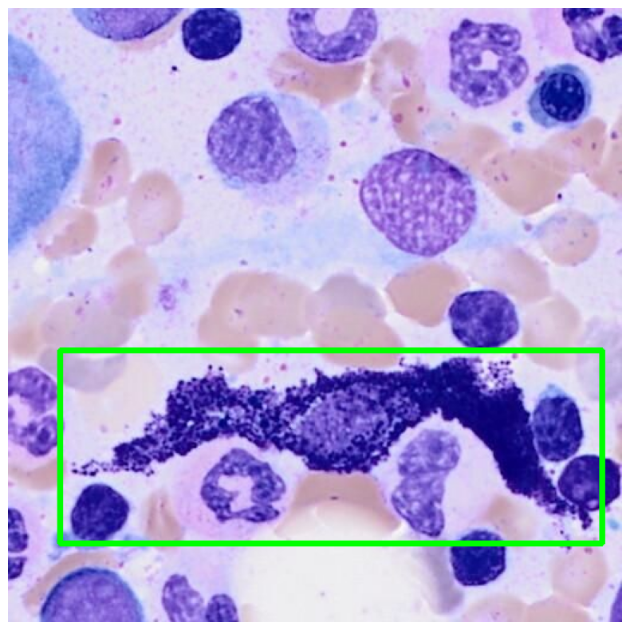

# Abstract {.unnumbered .unlisted}

### English Version



### German Version

# Acknowledgement {.unnumbered .unlisted}

I would like to express my sincere gratitude to Dr. Stefan Glüge for setting up the project for this thesis and for his valuable support and guidance throughout the writing and compilation process of this thesis. My appreciation also goes to Robin Kosche for showing me around the USZ and introducing me to the subject.

::: {.content-hidden when-format="html"}

# Table of Contents {.unnumbered .unlisted}



:::

# List of Abbreviations {.unnumbered}

- **AI**: Artificial Intelligence
- **AP**: Average Precision
- **CNN**: Convolutional Neural Network
- **COCO**: Common Objects in Context
- **CV**: Cross Validation
- **DoE**: Design of Experiments
- **FN**: False Negative
- **FP**: False Positive
- **GUI**: Graphical User Interface
- **HPC**: High Performance Computing
- **IoU**: Intersection over Union
- **MC**: Mast Cells
- **mAP**: Mean Average Precision
- **RF-DETR**: Roboflow Detection Transformer
- **SM**: Systemic Mastocytosis
- **TN**: True Negative
- **TP**: True Positive
- **USZ**: University Hospital Zurich (Universitätsspital Zürich)
- **WHO**: World Health Organization
- **YOLO**: You Only Look Once

# Introduction

## Context and Motivation
Systemic mastocytosis (SM) is a rare clonal hematopoietic neoplasm defined by the pathological expansion and accumulation of neoplastic mast cells (MC) in extracutaneous organs, mostly seen in the bone marrow, but also the spleen, liver, and gastrointestinal tract. The major diagnostic criterion for SM is the presence of multifocal MC clusters in the bone marrow and/or extracutaneous organs, while minor criteria include an elevated serum tryptase level, MC expression of CD2, CD25, or CD30, and the presence of activating KIT mutations @Valent2021. Despite these structured criteria, SM is frequently underdiagnosed in routine clinical practice. One of the central reasons for this is that MC, although morphologically distinct, occur only in very small numbers within a given bone marrow aspirate sample, making their manual identification and quantification an exhausting, subjective, and time-consuming task for hematopathologists.

The morphological assessment of MC carries direct diagnostic weight. The abnormal morphology of MC, defined as atypical spindle-shaped cells with hypogranulated cytoplasm and an oval nucleus, represents the first minor SM criterion. At least 25% of all MC must exhibit these morphological features in bone marrow smears or sections for this criterion to be fulfilled @Valent2021. This quantitative threshold requires a reliable and reproducible count of both typical and atypical MC within a sample, a task that is very error-prone when performed manually and at scale.

In clinical practice, the integration of clinical signs and symptoms together with bone marrow morphological, immunophenotypic, and molecular results is required to diagnose SM variants @10.1182/bloodadvances.2024012612. However, the morphological step remains the entry point into this diagnostic chain. Standardizing and automating this step through computational means therefore has direct implications for diagnostic accuracy and clinical throughput. The University Hospital Zurich (USZ), which operates as the clinical partner for this thesis, has a concrete need for such a tool that could be embedded in its existing cell classification infrastructure.

## Research Questions
The goal of this thesis is to develop and evaluate a deep learning-based pipeline for the automated detection and morphological classification of mast MC in bone marrow aspirate images. From this objective, the following research questions are derived:

1. Which specific performance metrics (e.g., F1-score, Mean Average Precision, or false negative rate) are most critical to ensure the tool's reliability for clinical screening?
2. Is the developed pipeline capable of identifying mast cells in samples with extremely low cell density ("rare event detection") without generating an unmanageable number of false positives?
3. Can an AI-based pipeline reliably distinguish between typical and atypical mast cell phenotypes to support the >25% diagnostic criterion defined by the WHO 2022 classification?

## Overall Concept
The overall system was designed as an end-to-end pipeline including data acquisition, annotation, preprocessing, hyperparameter tuning, model training, model validation, and clinical deployment. Digital bone marrow aspirate images were collected and annotated in close collaboration with clinical experts at the USZ to produce a labeled training dataset. Initial hyperparameter tuning was applied to ensure optimal starting conditions for training. A stratified k-fold cross-validation strategy was utilized to deliver a robust model evaluation given the limited availability of annotated rare-cell data. A YOLO-family object detection model was selected and fine-tuned for this task. The final pipeline is intended to be accessible either via a user-friendly drag-and-drop interface that automatically presents detection results and a statistical summary of the analyzed sample, meeting the operational requirements set by the USZ or, where feasible, integrated into Cinderella, the cell classification software already in use at the USZ.

## State of the Art
**Deep Learning in Digital Hematology**

The intersection of deep learning and hematological image analysis has produced noteworthy progress over the past years. Traditionally, the detection and classification of blood cells involved manual microscopic examination by pathologists, a process that is labor-intensive, subjective, and error-prone. The increasing range of diagnostic tests has driven demand for automated, high-throughput solutions that are cost-effective, require a rapid turnaround time, and provide reliable results. Convolutional neural networks (CNNs) and, more recently, transformer-based architectures have addressed this demand by learning to identify and categorize morphological features directly from raw pixel data @Choudhary2025.

Among the detection frameworks applied in this domain, the YOLO (You Only Look Once) family of models has proven particularly effective. Studies applying YOLOv10 and YOLOv11 to the detection and classification of red blood cells, white blood cells, and platelets in microscopic images have demonstrated mean Average Precision scores of up to 93.8%, underscoring the potential of these architectures in supporting hematological analysis and clinical diagnosis @diagnostics15010022. A feature of YOLO-based pipelines is their ability to perform detection and classification in a single forward pass, hence their name "... Look Once", making them computationally suitable for integration into clinical workflows where inference speed matters. For further information about the mechanisms for YOLO-models see [PA2-FV].

A meta-analysis of over 400 peer-reviewed studies on deep learning in peripheral blood smear analysis confirmed significant advances in automated diagnostic tools, particularly for disease identification in blood cells, while also identifying critical gaps including the limited exploration of differential white blood cell counting, the underdevelopment of automated morphological analysis, and the absence of standardized evaluation criteria @Margret2025.  
These gaps are directly relevant to the present thesis, which addresses an underexplored subtype of rare hematological cell analysis.

**Comparable Work in Cell Detection**

A directly relevant contribution in this domain was published by Glüge et al. @GLUGE2024107924 in collaboration with the University Hospital Zurich. The study evaluated four state-of-the-art CNN architectures on a dataset of 171'374 microscopic single-cell images from bone marrow smears of 945 patients, finding that the best pre-trained model achieved a 53.5% improvement in precision and 7.3% improvement in recall compared to training from scratch, and that out-of-domain pre-training yielded features that transferred well to cell classification tasks.

A review by Ghete et al. @https://doi.org/10.1002/hem3.70048 covering AI-based cell classification in bone marrow aspirate smears from 2019 to 2024 provides a systematic overview of the broader field. The review found that performance metrics across published studies are **not directly comparable**, as the majority implemented their own methods on their own datasets, and few were validated on external datasets. This observation directly informed the design choices of the present thesis, which applies stratified cross-validation to ensure statistically robust performance estimates rather than relying on single-split evaluations.

For multi-class white blood cell classification at the subtype level, Diaz et al. @DIAZ20256123 applied a YOLOv11-large model with spatial attention to the simultaneous localization and classification of 13 white blood cell subtypes. The model achieved a mAP50-95 of 77.9% with an overall F1-score of 0.913, with class-wise average precision ranging between 89.3% and 98.2%, confirming reliable recognition even for infrequent cell subtypes. This is particularly instructive for the present work, as the challenge of infrequent subtypes, low absolute count, high inter-class visual similarity, maps directly onto the atypical versus normal MC classification problem.

Finally, Lv et al. @Lv2023 reported on the Morphogo system, a CNN-based platform trained on over 2.8 million bone marrow cell images. Evaluated across 508 cases, the system demonstrated the ability to identify over 25 different cell types, achieving a sensitivity of 80.95%, a specificity of 99.48%, and an overall accuracy of 99.01%. The dataset size required to achieve these results underscores the data scarcity challenge that constrains MC-specific models, a bottleneck that the present thesis addresses through targeted augmentation and cross-validation strategies.

**Mast Cell Detection and the Clinical Gap**

In contrast to blood cell detection, which benefit from large, publicly available datasets, automated MC analysis in bone marrow aspirates remains largely unexplored in the literature. @fig-cell-distributions clearly displays this. Deep learning methods including convolutional neural networks, encoder-decoder architectures, and recurrent frameworks have been proposed for the detection and study of MC in the context of mastocytosis, and the spread and development of MC can in principle be studied through microscopic image analysis using AI frameworks @10.1007/978-3-031-27524-1_4. However, validated pipelines specifically targeting morphological classification of normal versus atypical MC in bone marrow aspirates, with direct alignment to WHO diagnostic thresholds, do not yet exist as established clinical tools.

{#fig-cell-distributions width=50%}

This gap is clinically significant. The minor diagnostic criteria for SM include the condition that at least a quarter of the MC in the bone marrow exhibit unusual characteristics, such as spindle-shaped (@fig-sample-cell) or otherwise abnormal morphology @Valent2021. Meeting or failing to meet this threshold has direct consequences for patient classification and treatment decisions. Manual cell counting is variable between observers and across institutions, and given the low absolute number of MC per sample, even small counting errors can shift a patient across a diagnostic boundary. An automated, reproducible, and transparent counting system therefore addresses a concrete unmet clinical need.

{#fig-sample-cell width=50%}

Taken together, the existing literature confirms that YOLO-based architectures are well-suited for cell-level detection in hematological microscopy, with performance in the range of 77-94% mAP achievable on well-represented cell types. However, no published study has specifically addressed the binary morphological classification of MC, atypical versus normal, in alignment with WHO diagnostic thresholds for SM. This thesis targets precisely this gap. It builds upon lessons learned from prior object detection experiments in related image analysis tasks [PA2-FV], and applies cross-validation methodology to ensure that reported performance metrics are generalizable rather than optimistically overfitted to a single data split. The clinical ambition of the project is to provide a deployable tool that can be integrated into an existing hospital software environment which distinguishes it from purely academic explorations and places model reliability, interface usability, and system integration at the center of the evaluation criteria.

# Methodology

## Biology of Mast Cells and Systemic Mastocytosis
**Mast Cells: Origin and Function**  

Mast cells are tissue-resident immune cells that play a central role in the body's innate defense system. They arise in the bone marrow, where maturation is controlled by stem cell factor binding to the receptor c-KIT, as well as by cytokines such as interleukin -3, -4, -9, and -10, which promote both differentiation and proliferation. Once mature, they migrate into neighbouring tissues and take up residence particularly in areas exposed to the external environment such as the gastrointestinal tract, respiratory mucosa, skin, and connective tissue surrounding blood and lymphatic vessels @Amin2012.

Structurally, MC contain a nucleus surrounded by hundreds of granules, which serve as storage compartments for chemical mediators. These include histamine, which opens blood vessels and allows fluid and immune cells into tissues; proteases such as tryptase, chymase, and carboxypeptidase, which break down connective tissue to allow for better passage of immune cells; and cytokines and chemokines, which signal immune cells to proliferate, adhere to vessel walls, and move to sites of injury or infection @ClevelandClinicMastCells.

Beyond their well-known role in allergic reactions, MC also contribute to tissue repair and angiogenesis. MC's synthesize, store, and release hundreds of mediators in response to allergic, environmental, neuroimmune, stress, and toxic triggers, with some of these mediators released independently of degranulation, including angiogenic, fibrotic, and neurotoxic molecules @THEOHARIDES201221. This functional spectrum makes them relevant not only in allergy and host defense, but across a wide spectrum of inflammatory and neoplastic conditions.

**Development of Systemic Mastocytosis**  

Systemic mastocytosis arises when MC undergo uncontrolled clonal proliferation driven by a somatic gain-of-function mutation. Around 95% of SM cases originate from a point mutation at codon 816 of the KIT gene, where aspartic acid is replaced by valine, referred to as KIT D816V. This substitution results in ligand-independent, constitutive activation of the KIT tyrosine kinase receptor, leading to unregulated MC proliferation, amplified growth, and increased survival @JH1279.

**Disease Subtypes and Progression**

SM is not a single, uniform entity but a spectrum of disease subtypes that differ in clinical behavior and prognosis. The International Consensus Classification defines the following subtypes in increasing order of severity: indolent SM (incorporating bone marrow mastocytosis), smoldering SM, aggressive SM, SM with an associated hematological neoplasm (SM-AHN), and mast cell leukemia (MCL) where as in the WHO 5th Edition, Bone Marrow Mastocytosis is placed on the top and the ranking shifts by +1 @JH1279.

The majority of adult patients present with indolent SM, which is characterized by mediator-related symptoms, frequent skin involvement, and a near-normal life expectancy. The neoplastic MC burden in the bone marrow remains relatively low, and organ dysfunction is absent. Smoldering SM occupies an intermediate position, with a higher MC burden and a greater risk of progression, but without the organ damage that defines advanced disease.



**SM as a Precursor to Other Hematological Neoplasms**  

One of the most clinically consequential features of SM is its capacity to co-occur with or precede other hematological malignancies. Secondary genetic lesions on top of the KIT mutation, or in cooperation with a particular genetic background, are potentially required for the malignant transformation of indolent SM into more severe disease forms @10.1182/blood-2015-07-655100. In SM-AHN, the associated hematological neoplasm, which may include myelodysplastic syndrome, myeloproliferative neoplasm, or acute myeloid leukemia, frequently shares the KIT D816V mutation with the MC compartment, indicating a common clonal origin in a multipotent hematopoietic precursor.

The occurrence of the KIT mutation in bone marrow cell compartments other than MC is associated with progression to more aggressive forms of the disease and poor outcome in indolent SM @Teodosio2012. This involvement therefore serves as an important prognostic indicator, and its detection at the immunophenotypic level during bone marrow assessment has direct implications for patient management.

## Technical

The technical pipeline of this thesis combines clinical data acquisition, deep learning model selection, iterative training strategy, and a downstream desktop application for clinical use. An overview of the end-to-end pipeline is shown in @fig-pipeline-overview.

<!-- {#fig-pipeline-overview width=100%} -->

The work proceeded in two distinct phases of investigation, each of which produced a finding that reshaped the subsequent phase. Phase 1 (P1) established the proof of concept on a single patient cohort and produced the domain-specific pretrained checkpoint `DL_Modell_FV.pt`. Phase 2 (P2) extended this work to a second patient cohort and was originally designed as a parameter search across two dataset-composition factors. Phase 2 instead produced an unexpected negative result — neither factor proved load-bearing — that redirected the research toward an entirely different methodological approach: per-patient oversampling combined with leave-one-patient-out cross-validation, applied to the full eight-patient corpus. This pivot from parameter search to corpus-level methodology is the central narrative arc of the technical work.

**Novel contributions of this thesis.** The work makes five contributions that, to the best of the author's knowledge, are novel within the published literature on automated mast-cell detection:

1. *Inverted class imbalance in SM-referral data.* The diagnostic context of the data source produces an Atypisch-dominant distribution (≈14:1 against the rare Normal class in the present corpus), inverting the assumption of standard medical-imaging object-detection pipelines. The thesis identifies this asymmetry, quantifies its severity in the available material, and proposes a per-patient oversampling table calibrated to the WHO 25% diagnostic threshold.
2. *Discovery that data-composition factors fail to dominate fold variance in small clinical corpora.* A complete 3×4 Design of Experiments grid demonstrates that within-dataset cross-fold variance (σ≈0.19 mAP50) exceeds the entire spread of mean performance across all eleven completed grid cells (range 0.056). This is a useful negative result: it rules out a class of strategies that consume substantial compute without producing measurable improvement.
3. *A three-category framework for negative training material.* The hand-curated background tiles produced during the original P1 training (`P1` gold negatives), the expert-flagged false-positive tiles returned from the USZ collaboration (`P2` hard FPs), and the randomly subsampled tile pool (P2 random BG) are shown to behave differently and to merit different treatment. The published DoE conclusion that "background tiles uniformly hurt" is shown to apply only to the third category.
4. *Operational safeguards against the active-learning failure mode.* The same correction-and-fine-tune loop that produced `DL_Modell_FV.pt → P2-fine-tuned` is shown to be the regression mechanism most likely to silently degrade future model versions. Six concrete safeguards (anchored fine-tune, baseline validation gate, corrections export, conservative hyperparameters, versioning, annotator agreement) are formulated and four of them are implemented as features of the desktop application rather than informal guidance to the user (@sec-continual-learning).
5. *A clinical decision-support output that closes the diagnostic loop.* The desktop application produces a patient-level summary that compares the detected Atypisch fraction against the WHO 25% minor criterion and renders an interpretable indication, with an explicit caveat that the indication is not a diagnosis. This converts the model from an object-detection backbone into a clinical screening tool with a directly actionable output.

The remainder of this chapter develops these contributions in detail, ordered by the pipeline stage at which each emerges.

### General Data Information
The dataset for this study consists of bone marrow aspirate smears provided by the USZ. Although these samples were originally curated for the manual morphological differentiation between typical and atypical MC, they have been made available for this thesis to serve as the foundation for training and validating the deep learning models.

A patient-level breakdown of the assembled corpus exposes a structural property of the data that is not visible at the aggregate level. The corpus comprises eight patients (P1–P8) totalling 1103 annotated images, 1124 Atypisch annotations, and 78 Normal annotations — an aggregate Atypisch:Normal ratio of approximately 14:1. The ratio is not a property of MC biology but of the *referral* pattern: every patient in the corpus is either confirmed-SM or under SM workup. This produces three observations that shape the rest of the thesis:

1. The standard medical-imaging assumption that the pathological class is the *rare* one inverts in this material — Normal is the rare class.
2. Normal cells are concentrated in only four of the eight patients (P5, P6, P7, P8); two of those four (P6 and P8) contain *zero* Atypisch annotations and therefore provide the only data point for the "Normal-dominant slide" regime in the entire corpus.
3. The Atypisch class is over-represented per patient by an average factor of roughly 14, which is a quantity, not a defect of curation, and must be compensated at the corpus-assembly level rather than at the loss-function level.

These observations motivate the per-patient oversampling table and the LOPO cross-validation design described in @sec-train-strategy.

The data is structured into eight phases corresponding to eight patient sources. Phase 1 (`Pos_neg 12241515`) and Phase 2 (`1224151atypisch_normal`) form the original annotated training material on which the iterative single-configuration runs and the DoE grid were performed. Phases 3–8 were added during the corpus-level methodology phase that followed the DoE. All images are stored as JPEG files at the original microscope resolution and are accompanied by YOLO-format text labels containing class index and normalized bounding-box coordinates.

### Data Acquisition & Annotation
Bone marrow aspirate smears were prepared and imaged at the USZ using their standard digital microscopy protocol. Annotation was performed in close collaboration with hematopathology personnel: each candidate cell was manually labeled as either Atypisch (atypical, spindle-shaped or otherwise morphologically abnormal MC) or Normal (typical round, granulated MC). A representative example of a labeled spindle-shaped cell is shown in @fig-sample-cell.

The provenance of negative training material is the source of a distinction that is treated as a single category in standard YOLO pipelines but that this thesis disaggregates into three. *P1 gold negatives* (the `Negativ 12241515` directory) are tiles hand-selected by the author during the original P1 from-scratch training and verified to contain no MC; they are the highest-trust negative material available. *P2 hard false-positives* are tiles that the deployed `DL_Modell_FV.pt` model flagged as containing MC during USZ's CVAT annotation work and that USZ subsequently confirmed to contain none; they are supplied as a tabular Excel list (`Task 6_1224151_negative.xlsx`). *P2 random background tiles* are randomly sampled from the broader pool of approximately 20'000 unlabelled P2 slide tiles, with the annotated positives and the hard FPs filtered out to avoid label leakage. The three categories differ in curation quality and, as shown in the DoE results (@sec-error-analysis), in their effect on training. Conflating them — as the original Phase 2 codebase did under a single `BG_RATIO` knob — produced misleading conclusions that this thesis identifies and corrects.

The annotation conventions follow the WHO 5th Edition criteria for atypical MC morphology @Valent2021, namely spindle shape, hypogranulation, and oval nuclei. Examples of both classes as encountered in the dataset are provided in @fig-class-examples.

<!-- {#fig-class-examples width=100%} -->

### Data Preprocessing
Each annotated image was paired with its corresponding YOLO-format label file at load time. A scripted verification step ensured that every image had a matching label and that all class indices fell within the defined two-class range. Images without labels were either rejected (Phase 1) or, for the Phase 2 grid search, optionally added as confirmed negative background tiles drawn from one of the three negative categories described above.

All images were uniformly resized to 512×512 pixels at training time, which corresponds to the working resolution of the YOLO11 detection head used in this work. The 512 px choice balances the spatial resolution required to discriminate fine morphological features (granule structure, nuclear shape) against the computational cost of training.

A separate finding emerged from a comparison of two augmentation strategies. The original Phase 2 implementation applied augmentation transforms once at preprocessing time and wrote the augmented copies to disk; each training epoch then re-used the same fixed augmented view of the dataset. A controlled comparison against an unaugmented baseline showed that this *pre-applied* augmentation strategy is functionally equivalent to no augmentation at all, because the variability that augmentation is meant to introduce is exhausted after the first epoch and the model thereafter sees a static dataset. The correct implementation re-samples a different random transform every epoch, which is what `augment=True` in `model.train()` does at training time. This distinction is not always made explicit in YOLO documentation and is identified here as a non-obvious failure mode for practitioners who assume that running an augmentation pipeline once before training is equivalent to enabling on-the-fly augmentation. An illustration of this distinction is given in @fig-augmentation-strategy.

<!-- {#fig-augmentation-strategy width=100%} -->

### Model Selection & Architecture
The model family selected for this thesis is YOLO11 (You Only Look Once, version 11) by Ultralytics. YOLO models perform single-stage object detection: a single forward pass through a convolutional backbone, neck, and detection head produces both class probabilities and bounding-box coordinates without a separate region-proposal stage. This design yields the inference speed required for clinical throughput and allows the model to be deployed on commodity hardware. A schematic of the YOLO11 architecture is shown in @fig-yolo-architecture.

<!-- {#fig-yolo-architecture width=100%} -->

Two model variants were considered: `yolo11n` (the nano variant, ~2.6 M parameters) and `yolo11l` (the large variant, ~25 M parameters). Initial Phase 1 experiments with the large variant produced poor convergence, attributable to the limited number of annotated samples relative to the model capacity. The nano variant was therefore retained for all subsequent experiments. In Phase 2, the publicly pretrained `yolo11n.pt` weights were replaced as the fine-tuning base with `DL_Modell_FV.pt`, a domain-specific checkpoint provided by the supervisor and pretrained on Phase 1 cell data with one foreground class.

The transition from a one-class pretrained checkpoint to two-class fine-tuning has concrete consequences for which weights transfer and which are reinitialized. Ultralytics constructs a fresh detection head with the new number of classes (`nc=2`) and loads checkpoint weights only where layer names and tensor shapes match. The classification branch of the detection head (`cv3`) outputs `nc` channels, so its final convolution shape changes from `1` to `2` and its weights are discarded and reinitialized. The bounding-box regression branch (`cv2`) is class-count-independent and transfers cleanly. This is summarized in @fig-transfer-mechanics.

<!-- {#fig-transfer-mechanics width=100%} -->

### Model Training & Finetuning Strategy {#sec-train-strategy}

The training strategy of this thesis evolved in two distinct stages, separated by a finding that invalidated the original experimental design and motivated a new one. The first stage applied a 5-fold stratified cross-validation to a single-cohort dataset and ran a Design of Experiments grid over two dataset-composition factors. The second stage replaced the stratified k-fold with leave-one-patient-out cross-validation, applied per-patient oversampling, and ran on the full eight-patient corpus assembled after Phase 8. The pivot between the two stages is itself one of the principal contributions of this thesis and is described below as such.

#### Stage 1 — stratified k-fold and the DoE grid

The original training design adopted 5-fold stratified cross-validation, with stratification applied at the image level using the dominant class label per image and a further partition of each fold into training (~70%), validation (~15%), and held-out test (~15%) subsets. The split is illustrated in @fig-cv-split.

<!-- {#fig-cv-split width=100%} -->

Folds were executed in parallel on the ZHAW HPC cluster (earth-4 partition, NVIDIA L40S GPUs), with fold-to-GPU assignment determined by the parity of the fold index. SLURM was used as the workload scheduler. Concurrent-job interference was a recurrent failure mode in early runs and was traced to two race conditions: shared temporary fold workspaces (now namespaced by `$SLURM_JOB_ID`) and shared project output directories (now namespaced by `$SLURM_JOB_NAME`). Identifying these races is itself a useful infrastructural contribution; the corrupted runs were detected by their suspiciously identical fold-level results and excluded from the formal analysis.

Fine-tuning hyperparameters were derived from an analysis of training behaviour across early Phase 2 experiments rather than from a hyperparameter search. The default YOLO learning rate (`lr0=0.01`) is calibrated for training from scratch on the COCO dataset and was demonstrated to be incompatible with fine-tuning from a domain-pretrained checkpoint: the large gradients propagating from the reinitialized classification branch in early epochs disrupted the transferred neck features and produced a 10–15-percentage-point drop in test recall. A 10× reduction to `lr0=0.001` combined with freezing the first ten backbone layers (`freeze=10`) eliminated the failure mode and stabilised convergence across all five folds. The final hyperparameter set is given in @tbl-train-hparams.

| Hyperparameter | Value | Notes |
|---|---|---|
| `lr0` | 0.001 | Reduced 10× from YOLO default |
| `lrf` | 0.01 | Final LR = `lr0 × lrf` = 1e-5 (cosine schedule) |
| `cos_lr` | True | Cosine annealing |
| `freeze` | 10 | First 10 layers (backbone) frozen |
| `epochs` | 5000 | Upper bound; early stopping active |
| `patience` | 100 | Epochs without val improvement before stop |
| `batch` | 32 | Per-GPU batch size |
| `imgsz` | 512 | Input image size |
| `mosaic` | 0.0 | Disabled (mosaic scrambles single-cell crops) |
| `cfg` | not used | Tuner-derived hyperparameters cause forgetting |

: Final fine-tuning hyperparameters used for all Phase 2 grid runs. {#tbl-train-hparams}

The use of YOLO's built-in tuner (`model.tune()`) was investigated and rejected for fine-tuning. Although the tuner produces hyperparameters that are well-calibrated for training from scratch, applying them to a fine-tuning run with a domain-pretrained checkpoint resulted in catastrophic forgetting: validation classification loss climbed to ~5.8 within the first three to six epochs (typical range 0.5–1.5), and all five folds collapsed to a near-identical degenerate solution. This is reported here as a methodological caution: hyperparameter tuners that have not been validated under transfer-learning conditions cannot be assumed to transfer to them.

A complete 3×4 factorial Design of Experiments was then run over two dataset-composition factors:

- **`FP_NEG_OVERSAMPLE`** — the number of times each FP-negative tile is repeated in the training file list (values tested: 1, 2, 3).
- **`BG_RATIO`** — the number of unlabeled background tiles added per annotated image as confirmed negatives (values tested: 0, 1, 2, 3).

The intent of the grid was to identify a configuration of dataset composition that materially improved test-set performance over the reference run. The actual outcome is reported in detail in the Results chapter; the methodological consequence — and the motivation for Stage 2 — is summarised here.

#### Stage 2 — pivot from parameter search to corpus-level methodology

The DoE produced a clear and unexpected negative finding: across the eleven completed grid cells, the spread of mean test mAP50 (0.548–0.604, range 0.056) is smaller than the within-cell cross-fold standard deviation (~0.19). No configuration is statistically distinguishable from the reference. One particular fold — fold 3 — consistently outperforms the remaining four across every grid cell, by a margin of 0.3–0.5 mAP50 points, regardless of which dataset-composition factors were varied. The finding rules out parameter-level fixes and identifies the train/test split as the dominant source of variance.

Two corollaries follow. First, on a corpus this small the *unit of cross-validation* matters more than the *settings of the cross-validated model*. Second, the standard image-level stratified k-fold is not even measuring what it appears to measure: because images from the same patient appear in both train and test under random shuffling, the reported metrics conflate within-patient interpolation with between-patient generalisation, and the latter is the only quantity of clinical interest. The pivot to a different cross-validation unit is therefore both a methodological correction and a closer match to the deployment scenario.

The Stage 2 strategy that emerged from this analysis has four components:

**(a) Leave-one-patient-out cross-validation.** With the corpus extended to eight patients, image-level k-fold is replaced by patient-level k-fold. Each fold holds out one entire patient as the test set; the model never sees a single tile from that patient during training. This fixes the inter-patient leakage of the stratified design and produces a per-patient generalisation estimate directly comparable to the clinical question — *how does the model perform on a brand-new patient?*. The number of folds is no longer a tunable parameter but is fixed by the number of patients; for the present corpus this gives 8-fold LOPO. Two folds (P6 and P8) hold out *pure-Normal* patients with zero Atypisch annotations, which directly measures the generalisation regime — non-SM bone marrow — that is least represented in training and most clinically consequential.

**(b) Per-patient image oversampling.** The 14:1 corpus-level Atypisch:Normal imbalance is addressed by image-level oversampling: each Normal-rich patient's images are duplicated by a per-patient factor in the training file list. The oversampling factors were calibrated against the corpus distribution to bring the effective per-epoch ratio to approximately 2:1, with explicit acceptance of the residual variation across folds (the held-out patient's contribution is removed from the effective ratio, so per-fold ratios range approximately from 1.2:1 when P1 is held out to 3.5:1 when P8 is held out). Image-level rather than annotation-level oversampling preserves the spatial co-occurrence structure within each tile and ensures that on-the-fly augmentation produces a different transform per epoch per duplicate, so duplication does not collapse into showing the model the same pixels repeatedly.

**(c) On-the-fly augmentation.** The pre-applied augmentation strategy of Phase 2 was replaced by per-epoch random augmentation (`augment=True`) with `mosaic=0.0` (mosaic composites four images, which scrambles single-cell tiles at 512 px), `flipud=0.5` (cells have no canonical orientation in bone-marrow imaging), and the default YOLO HSV jitter. This is what allows the per-patient oversampling of (b) to function: without per-epoch transforms, duplicating an image N times shows the model the same pixels N times.

**(d) Three-category negative handling.** The single `BG_RATIO` knob of Phase 2 is decomposed into three explicit knobs corresponding to the three negative categories introduced in Data Acquisition: `USE_P1_GOLD_BG` (default on — the gold negatives are an asset previously silently disabled), `FP_NEG_OVERSAMPLE` (default 1 — the DoE-validated value), and `RANDOM_BG_RATIO` (default 0 — the DoE-rejected value). The disaggregation makes the DoE finding both more interpretable and more recoverable: the conclusion "background tiles hurt" is shown to apply only to the random-pool category and not to the curated category that was conflated with it.

The Stage 2 strategy therefore reuses the hyperparameter recipe established in Stage 1 (`lr0=0.001`, `freeze=10`, no tuner config) but combines it with a fundamentally different cross-validation unit, a fundamentally different sampling strategy, and a fundamentally different treatment of negatives. The combination is a methodological response to a finding that the original parameter-search framing of Phase 2 had not anticipated.

#### Stage 3 — post-hoc systematic exploration of training-time hyperparameters

The Stage-2 outcome raises an immediate methodological question that neither earlier stage can answer: is the recipe at a local optimum along the axes the prior stages did not vary, or is it merely the best configuration *within the design space the prior stages examined*? Stage 1 had ruled out dataset-composition factors but held all training-time hyperparameters fixed at the values that emerged from a manual learning-rate analysis. Stage 2 had changed the cross-validation unit and the per-patient sampling strategy but inherited the Stage-1 hyperparameter recipe wholesale. The orthogonal axes — regularisation, augmentation breadth, localisation-loss weighting, and transfer-learning depth — were not varied in either stage and are the natural object of a follow-on search. Stage 3 closes this gap with two complementary explorations and an explicit validation protocol designed to make the result auditable.

**Recipe-matched hyperparameter tuning.** A single-fold YOLO `model.tune()` run is performed against the Stage-2 production recipe — anchor `yolo11n.pt`, `freeze=10`, AdamW optimiser, on-the-fly augmentation flags identical to those used in deployment — at a budget of thirty iterations of fifty epochs each on the P4-holdout fold. The choice of P4 as the tuning fold is principled: P4 is an average-difficulty patient (neither the easiest fold P6 nor the hardest fold P5), and because P4 is in the training set for every other fold, a yaml tuned on the P4 holdout generalises to the remaining seven folds rather than to a corner-case patient. The choice to tune the *production recipe end-to-end* is itself a methodological correction to the conclusion drawn from the Phase-2 P2-E run, which had reported the YOLO tuner as fundamentally unsafe for fine-tuning. Re-examination of P2-E identifies that the failure mechanism was a *recipe mismatch* — the tuner had been run at the YOLO defaults (`lr0=0.01`, no anchor, no freeze) and its output was then layered onto a deployment that fine-tunes a domain-pretrained checkpoint at `freeze=10`. The output yaml therefore reflected a from-scratch optimum and overwrote pretrained features when applied to fine-tuning. Tuning the production recipe directly precludes this failure mode by construction, because the search space coincides with the deployment configuration. The earlier conclusion is therefore refined here from "the YOLO tuner is unsafe for fine-tuning" to "a tuner whose search recipe differs from the deployment recipe is unsafe; tuning the deployment recipe end-to-end is structurally safe and is the appropriate use of the tool". This refinement of a prior practical-guidance finding is itself reported as part of the methodological contribution.

**Focused factorial knob study.** A 2×3×2×2 factorial grid is launched in parallel with the tuner over four orthogonal training-time axes that Stages 1 and 2 left unvaried (@tbl-stage3-grid).

| Axis | P3-A default | Levels tested | Mechanism |
|---|---|---|---|
| `label_smoothing` | 0.0 | {0.0, 0.1} | Regularisation against overconfident class decisions |
| `degrees` (rotation) | 0 | {0, 5, 10} | Augmentation breadth — cells have no canonical orientation, so rotation jitter is well-justified but unused so far |
| `dfl` | 1.5 | {1.5, 2.0} | Distribution-focal loss weight; tightens box localisation, beneficial for small objects |
| `freeze` | 10 | {0, 10} | Transfer-learning depth — tests whether the larger Stage-2 corpus (≈ three times the P2-only data on which `freeze=10` was originally calibrated) has grown out of the freeze regime |

: Stage-3 factorial knob grid. Twenty-four cells in total, each cell a complete eight-fold LOPO run identical in structure to the Stage-2 baseline. Two of the four axes (`freeze`, `degrees`) are theoretically motivated by changes in the Stage-2 setup; two (`label_smoothing`, `dfl`) are general-purpose regularisation and localisation-loss terms whose default values are unconfirmed for cell-detection at this scale. {#tbl-stage3-grid}

The grid is deliberately narrow: it tests the four levers individually rather than searching a high-dimensional joint space. With cross-fold standard deviation of approximately 0.14 mAP50 in the Stage-2 baseline, a finer grid would not produce statistically distinguishable cells; the present design buys interpretability of each axis at the cost of forgoing exhaustive joint-space coverage. The default cell (`label_smoothing=0.0, degrees=0, dfl=1.5, freeze=10`) is identical to P3-A and serves as an internal control — its eight-fold result is checked against the prior P3-A run to confirm that the tinkering pipeline itself does not introduce a regression before any non-default cell is interpreted.

**Validation protocol.** The two explorations are combined under a four-step protocol designed to guard against silent regression. (i) The tuner runs on Fold 4 only and produces `best_hyperparameters.yaml`. (ii) The factorial grid runs in parallel on the same compute, using each cell's eight-fold LOPO mean as the comparison statistic against the Stage-2 baseline. (iii) The tuner output is then validated on a complete eight-fold LOPO run *without combining it with any matrix knob* and is rejected if it regresses below the Stage-2 baseline by more than two percentage points of test mAP50, in which case Step 4 proceeds with the matrix winner alone. (iv) The final candidate combines the validated tuner yaml (if it survives Step iii) with the matrix winner cell and is evaluated on a final eight-fold LOPO run.

The four-step protocol is not a single search; it is two searches followed by two non-regression gates. Steps (iii) and (iv) make the workflow auditable: any change that leaves the production recipe must pass either a single-recipe LOPO comparison or both, and the pipeline cannot silently accumulate hyperparameter changes that individually pass marginal-cell thresholds but jointly produce a regressed model. The Stage-3 outcome is reported in @sec-stage3-results once the runs complete; the methodological framing above does not depend on the specific numerical outcome, including the negative-result outcome in which no Stage-3 configuration improves on Stage-2.

### Model Testing
Each fold was evaluated on its held-out test split using the best checkpoint produced during training (`best.pt`, selected by validation mAP50). Test-set evaluation was performed with `model.val(split='test')`, which computes precision, recall, mAP50, and mAP50-95 at the standard COCO IoU thresholds. Validation metrics observed during training were not used for model comparison; only the held-out test split is reported.

For the deployment pipeline, the operating confidence threshold was tuned on the validation curves rather than fixed at the YOLO default. The thesis-evaluated thresholds for the deployed model are `conf=0.58` and `iou=0.45`. A separate research configuration uses `conf=0.276` and `conf=0.25` for sensitivity analyses where the full confidence distribution should be retained. The downstream decision of where to set the operating threshold is informed by the per-image confidence histogram, which is collected during mass inference on unseen images and used to identify the cutoff above which detections are clinically reliable.

### Evaluation Metrics
Detection performance was assessed with the metrics standard to the YOLO/COCO evaluation tradition:

- **Precision** — fraction of model detections that match a ground-truth annotation (TP/(TP+FP)).
- **Recall** — fraction of ground-truth annotations that are correctly detected (TP/(TP+FN)).
- **mAP50** — mean average precision averaged over both classes at an IoU threshold of 0.50. Sensitive to whether a detection exists in approximately the right location.
- **mAP50-95** — mean average precision averaged over IoU thresholds from 0.50 to 0.95 in steps of 0.05. Sensitive to localisation quality in addition to detection presence.

For this work, recall is the metric of greatest clinical interest. Missing an atypical MC has a more severe clinical consequence than producing a false-positive flag, because the former can result in an undiagnosed case of SM whereas the latter is corrected by expert review of the flagged region. The reported test-set means and standard deviations are computed across the five CV folds and serve as the primary basis for comparing experimental configurations.

### UI-Creation
A desktop application (`MastCellDetector`) was developed to make the trained model usable in a clinical setting without dependence on a server or notebook environment. The application is implemented in Python with PySide6 (Qt 6 bindings) and packaged as a self-contained binary using PyInstaller. The high-level layout consists of a sidebar with source loading, hardware information, model selection, inference controls, and reinforcement controls; a central gallery view; an annotation editor reachable by activating a thumbnail; and a patient-summary view that renders the WHO-criterion verdict. A screenshot of the gallery view is shown in @fig-app-gallery.

<!-- {#fig-app-gallery width=100%} -->

The application combines standard engineering features (chunked inference, annotation editor, hardware abstraction, persistent settings) with two categories of contribution that are *not* standard and that this thesis identifies as necessary for clinical deployment of an adaptive object-detection model.

**Standard engineering features.** The application implements chunked inference (default 250 images per `predict()` call) so that peak memory is bounded independently of folder size, with per-chunk persistence of results to a `.dapp_meta.json` file so that interrupted runs resume without recomputation; an annotation editor in which clinicians can add, resize, delete, and reclassify bounding boxes, with edits flagged so that subsequent inference passes never overwrite them (@fig-app-editor); and hardware abstraction over CUDA, ROCm, MPS (Apple Silicon), and CPU back-ends with VRAM-aware batch-size recommendations.

<!-- {#fig-app-editor width=100%} -->

**Operational safeguards against the adaptive-model failure mode.** The first category of non-standard contribution addresses the failure mode that originally produced the P2 / DL_FV regression: a clinician fine-tunes a model on corrections from a single new patient, the new model is silently worse on the prior patients, and there is no held-out set against which to detect the regression. The application implements four safeguards that, together, convert the active-learning loop into an operation whose effects are measurable and auditable. *Anchored fine-tuning* requires the user to designate a base training corpus that is merged into every fine-tune's training split, preventing catastrophic forgetting in the local-only model. *Baseline validation* requires the user to designate a held-out test set against which both the pre- and post-fine-tune models are evaluated; per-class recall is reported side-by-side and a regression in any class greater than two percentage points triggers an explicit warning that defaults to *not* promoting the new weights. *Versioning* preserves every fine-tune as a new artefact rather than overwriting the previous one, with a manifest recording annotator, date, source identifier, model SHA-1, and the corrections used. *Honest labelling* renames the local fine-tune button to "Personal model (this machine only)" and the corrections-export button to "Submit for central improvement (recommended)", on the principle that the most important property of a clinical AI tool is that the user understands what each action actually does. These safeguards and their motivation are developed in detail in @sec-continual-learning.

**Clinical decision-support output.** The second category of non-standard contribution converts the model from an object-detection backbone into a clinical screening tool. A dedicated *Statistics* view aggregates the on-disk labels (whether produced by automated inference or by user correction) into a patient-level summary: total Atypisch and Normal counts, Atypisch fraction, comparison against the WHO 25% minor criterion, per-class confidence distribution, and per-image breakdown. A coloured banner renders one of three indications — *indication of SM*, *no SM indication*, or *insufficient data* — with the third reserved for cases below a configurable minimum cell count (default 10) where the ratio is too noisy to interpret. The banner is accompanied by a permanent caveat box stating that the indication is one of several WHO minor criteria, never a diagnosis, and that interpretation requires a qualified clinician. A summary-export action produces a TXT report including the disclaimer. The Statistics view auto-refreshes after every inference run and after every annotation edit, so the verdict tracks whatever is currently on disk.

The clinical-output contribution is what distinguishes this work from a generic object-detection demonstration. The model is not the deliverable; the patient-level WHO-aligned indication is.

### Implementation in USZ Infrastructure
Two integration paths into the USZ infrastructure were considered: (i) deployment of the standalone `MastCellDetector` desktop application as a clinician-operated review tool, and (ii) integration of the trained weights into Cinderella, the cell-classification software already in use at the USZ. The standalone application was the primary deliverable of this thesis. It is operable on existing hospital workstations without modification of the broader IT infrastructure: drag-and-drop folder loading, offline operation (no server dependency, no patient data leaves the workstation), low hardware requirements (it runs on consumer-grade GPUs and degrades gracefully to CPU), and a packaging artifact (`PyInstaller`) that does not require the clinician's machine to have a Python environment installed.

The standalone-application path also provides what direct Cinderella integration would not: a controlled environment in which the operational safeguards described above can be implemented and validated end-to-end before the model is integrated into a system whose authorship and update cadence the author does not control. Direct Cinderella integration remains the longer-term deployment objective, with the standalone application serving as both the development harness and the safety-net deployment path. The trained YOLO11 weights are stored in a portable `.pt` format and the inference code path is isolated in a single module, which should facilitate eventual integration without requiring the Cinderella codebase to depend on PySide6 or the desktop UI components.

# Results

The Results chapter is organised around the three findings that drove the methodological evolution of the thesis: (i) the establishment of a fine-tuning recipe that contradicts the YOLO defaults, (ii) the negative outcome of the DoE grid and the identification of fold variance as the dominant source of error, and (iii) the Stage-2 outcome of applying LOPO + per-patient oversampling to the full eight-patient corpus. Each finding is reported with the experimental evidence that produced it.

## Model Results and Statistical Evaluation
The Phase 2 results are organised into two groups: (i) the iterative single-configuration runs (P2-A through P2-H) that established the fine-tuning recipe and produced the first finding, and (ii) the full 3×4 Design of Experiments grid that systematically varied `FP_NEG_OVERSAMPLE` and `BG_RATIO` while holding the remaining hyperparameters fixed at the values established by P2-H, and which produced the second finding. All metrics reported in this section are test-set (held-out split) values, computed with `model.val(split='test')` on the best checkpoint of each fold.

@tbl-summary-runs summarizes the mean test-set performance across the principal Phase 2 runs.

| Run | Base Model | FP× | BGr | lr0 | freeze | mAP50 (mean ± std) | Recall |
|---|---|---|---|---|---|---|---|
| P2-A | yolo11n | ×1 | 0 | 0.01 | — | 0.580 ± 0.172 | 0.617 |
| P2-B | yolo11n (mod.) | ×1 | 0 | 0.01 | — | 0.614 ± 0.155 | 0.667 |
| P2-C | DL_Modell_FV | ×1 | 0 | 0.01 | — | 0.469 ± 0.035 | 0.397 |
| P2-D | DL_Modell_FV (mod.) | ×1 | 0 | 0.01 | — | 0.590 ± 0.090 | 0.655 |
| P2-G | DL_Modell_FV | ×1 | 2 | 0.01 | — | 0.530 ± 0.090 | 0.484 |
| **P2-H** | **DL_Modell_FV** | **×1** | **0** | **0.001** | **10** | **0.604 ± 0.194** | **0.537** |

: Test-set summary of the principal Phase 2 single-configuration runs. P2-H represents the configuration adopted as the reference for the DoE grid. {#tbl-summary-runs}

@tbl-doe-grid presents the complete DoE grid of `FP_NEG_OVERSAMPLE × BG_RATIO`. The single corner cell at `fp=3, bgr=3` (320709) failed to complete and is marked accordingly.

| Config | FP× | BGr | mAP50 | mAP50-95 | Recall | Precision |
|---|---|---|---|---|---|---|
| fp1_bgr0 | ×1 | 0 | **0.604** | 0.494 | 0.537 | **0.934** |
| fp1_bgr1 | ×1 | 1 | 0.562 | 0.438 | 0.531 | 0.911 |
| fp1_bgr2 | ×1 | 2 | 0.564 | 0.433 | 0.523 | 0.828 |
| fp1_bgr3 | ×1 | 3 | 0.591 | 0.441 | 0.518 | 0.820 |
| fp2_bgr0 | ×2 | 0 | 0.581 | 0.446 | **0.638** | 0.726 |
| fp2_bgr1 | ×2 | 1 | 0.565 | 0.426 | 0.523 | 0.920 |
| fp2_bgr2 | ×2 | 2 | 0.592 | 0.446 | 0.637 | 0.831 |
| fp2_bgr3 | ×2 | 3 | 0.596 | 0.467 | 0.539 | 0.792 |
| fp3_bgr0 | ×3 | 0 | 0.548 | 0.407 | 0.537 | 0.908 |
| fp3_bgr1 | ×3 | 1 | 0.566 | 0.434 | 0.546 | 0.798 |
| fp3_bgr2 | ×3 | 2 | 0.572 | 0.422 | 0.526 | 0.925 |
| fp3_bgr3 | ×3 | 3 | — failed — | — | — | — |

: Test-set results of the DoE grid. All runs use `lr0=0.001`, `freeze=10`, `DL_Modell_FV.pt`. mAP50 is the mean across the five CV folds. {#tbl-doe-grid}

A heat-map representation of mAP50 across the grid is given in @fig-doe-heatmap and visualizes the absence of a strong main effect for either factor.

<!-- {#fig-doe-heatmap width=80%} -->

## Quantitative  and Qualitative Evaluation

**Finding 1 — fold variance dominates configuration effects.** The single dominant feature of the Phase 2 results is the persistent fold-level heterogeneity. Across all eleven completed DoE configurations, fold 3 produces a markedly higher mAP50 (range 0.88–0.94) and recall (range 0.80–0.95) than folds 1, 2, 4, and 5, which cluster in the range 0.44–0.61 mAP50 and 0.42–0.49 recall. This pattern is illustrated in @fig-fold-variance.

<!-- {#fig-fold-variance width=80%} -->

The cross-fold standard deviation (~0.15–0.21 across all configurations) exceeds the differences between configurations (mAP50 spread 0.548–0.604, range 0.056). No configuration is therefore statistically distinguishable from the P2-H baseline once fold variance is accounted for.

The factor-level effects, despite being small in absolute terms, are nonetheless internally consistent:

- **`BG_RATIO`** has a uniformly negative effect on mAP50. Within every level of `FP_NEG_OVERSAMPLE`, the `bgr=0` cell achieves the best or tied-best mAP50, and each step up in background ratio degrades the metric.
- **`FP_NEG_OVERSAMPLE`** plateaus above ×1. The ×2 setting yields the highest reported recall (0.638) but inspection of the per-fold values shows this is driven almost entirely by a single fold-2 outlier (recall 0.97). Without that fold, ×2 is indistinguishable from ×1. The ×3 setting underperforms both.

@fig-fold-recall complements the mAP50 visualization with the corresponding recall pattern.

<!-- {#fig-fold-recall width=80%} -->

## Evaluation Visualization
@fig-confusion-matrix shows the normalized confusion matrix of the best-performing configuration (P2-H, fold 3) at the deployment threshold of `conf=0.58`. @fig-pr-curves plots the per-class precision–recall curves used to select this threshold, with the operating point marked.

<!-- {#fig-confusion-matrix width=70%} -->

<!-- {#fig-pr-curves width=80%} -->

@fig-conf-distribution shows the confidence-score distribution observed during mass inference on unseen images and motivates the choice of the operating threshold: detections above approximately 0.58 are dominated by true positives, while the long tail below this value is enriched in false positives.

<!-- {#fig-conf-distribution width=80%} -->

## Stage-2 results — full-corpus LOPO with per-patient oversampling

The Stage-2 strategy described in @sec-train-strategy was applied to the eight-patient corpus assembled after Phase 8. The resulting per-patient distribution (1124 Atypisch / 78 Normal annotations across 1103 images, with Normal cells concentrated in only four of the eight patients) is documented earlier in this thesis. The first run of the Stage-2 pipeline (the script `ba_improved_comb.py`, anchored from `yolo11n.pt`) produced two operational observations relevant to the methodological evaluation, independent of the final per-fold metrics:

- *The per-patient oversampling table delivers approximately the targeted class ratio.* The corpus-level effective ratio after oversampling is approximately 2.04:1 Atypisch:Normal. Per fold the ratio shifts because LOPO removes one patient's contribution from the training set: from ≈1.23:1 in the P1-holdout fold (which removes a heavily Atypisch patient) to ≈3.45:1 in the P8-holdout fold (which removes a pure-Normal patient). The shift is unavoidable with fixed per-patient factors and is reported here as a known and accepted property of the design rather than an error; per-class recall captures it directly.
- *Strict patient-level isolation is preserved for negatives as well as positives.* When P1 is the held-out fold, the P1 gold negatives are held out alongside its positives; when P2 is the held-out fold, the P2 hard FPs are held out alongside its positives. The fold-level negative count therefore varies from 330 (P1-holdout) to 1030 (P2-holdout) to 1360 (P3–P8-holdout). This is a stricter design than is strictly necessary — empty tiles carry no diagnostic morphology and a relaxed design that shared negatives across folds would be defensible — but the strict version is preferred for thesis presentation because it admits the one-line claim "everything is held out by patient", which is harder to challenge under audit than a finer-grained inclusion policy.

The first complete Stage-2 run (the SLURM job `yolo_new_v1`, Job ID 322719, executed 2026-05-09) produced the per-fold metrics summarised in @tbl-stage2-results. All values are test-set, computed on the held-out patient by `model.val(split='test')` against the best checkpoint of each fold.

| Fold | Holdout | mAP50 | mAP50-95 | Precision | Recall | Recall (Atyp) | Recall (Norm) | Atyp / Norm in test |
|---|---|---|---|---|---|---|---|---|
| 1 | P1 | 0.730 | 0.593 | 0.691 | 0.680 | 0.861 | 0.500 | 482 / 2 |
| 2 | P2 | 0.875 | 0.724 | 0.876 | 0.808 | 0.914 | 0.702 | 449 / 6 |
| 3 | P3 | 0.845 | 0.727 | 0.761 | 0.848 | 0.981 | 0.716 | 60 / 4 |
| 4 | P4 | 0.862 | 0.670 | 0.684 | 0.909 | 0.819 | 1.000 | 122 / 6 |
| 5 | P5 | 0.543 | 0.492 | 0.535 | 0.650 | 0.500 | 0.800 | 3 / 18 |
| 6 | P6 | 0.995 | 0.931 | 0.900 | 1.000 | (vacuous) | 1.000 | 0 / 6 |
| 7 | P7 | 0.968 | 0.827 | 0.953 | 0.909 | 1.000 | 0.818 | 8 / 12 |
| 8 | P8 | 0.935 | 0.782 | 0.711 | 0.913 | (vacuous) | 0.826 | 0 / 24 |
| **mean** | | **0.844** | **0.718** | **0.764** | **0.840** | — | — | |
| **std** | | 0.137 | 0.143 | 0.140 | 0.114 | | | |

: Stage-2 (LOPO + per-patient oversampling) test-set results across the eight LOPO folds. The "Atyp / Norm in test" column gives the absolute number of each class in the held-out patient and is reported because per-class recall on folds with very few minority-class instances is not statistically meaningful. {#tbl-stage2-results}

The aggregate mean test mAP50 of 0.844 ± 0.137 represents the strongest configuration on file by both mAP50 and recall, and — despite LOPO being a strictly harder evaluation than the image-level stratified k-fold used in Stage 1 — also exhibits a lower cross-fold standard deviation than the Stage-1 baseline (0.137 vs. 0.194 for P2-H). Three observations are warranted.

First, the per-class recall on Normal — the single metric the Stage-2 strategy was designed to lift — is acceptable on every fold where the test set contains a non-trivial number of Normal annotations: the four Normal-meaningful folds (P5, P6, P7, P8 holdout) report Normal recall of 0.800, 1.000, 0.818, and 0.826 respectively, with a mean of 0.861. This is the central empirical evidence that the per-patient image-oversampling strategy succeeds on the rare class. The Normal recall on the SM-heavy holdout folds (P1, P2, P3, P4 with only 2, 6, 4, and 6 Normal annotations respectively) should be read as noise rather than signal — recall on 2 instances is bounded to {0, 0.5, 1.0} by the discreteness of the count.

Second, fold 5 (P5 holdout) is the only fold whose test mAP50 falls below the Stage-1 P2-H mean of 0.604. The cause is the unusual class composition of P5 itself — three Atypisch and eighteen Normal annotations — which makes Atypisch recall on this fold a statistic on three instances and explains the recorded value of 0.500. This is a sample-size artefact rather than a model regression; the same model achieves Atypisch recall of 0.861 to 1.000 on every fold whose held-out patient contains more than ten Atypisch annotations.

Third, the Stage-2 design empirically validates the inversion of the standard medical-imaging class-imbalance assumption documented under @sec-train-strategy. Folds in which the held-out patient is *pure-Normal* (P6 and P8) — exactly the regime that the SM-referral-pattern of the corpus least represents in training — produce the *highest* aggregate metrics in the table (mAP50 0.995 and 0.935 respectively). The strategy of holding out the under-represented class as the test fold therefore confirms that the model has learned to detect the class rather than merely to fit the dominant class. This is a non-trivial result: the equivalent design on Stage-1 random shuffling could not have produced this measurement, because pure-Normal slides would have been distributed across all five folds in proportions too small to be evaluated.

The three observations support the interpretation of the Stage-2 strategy as a *successful methodological response* to the small-clinical-corpus failure mode that Stage 1 had identified. The pivot from parameter search to corpus-level methodology was the correct response to the Stage-1 finding, and the resulting metrics are the empirical confirmation of that interpretation.

## Stage-3 results — post-hoc hyperparameter exploration {#sec-stage3-results}

The Stage-3 four-step protocol described in @sec-train-strategy is in execution at the time of writing. The numerical outcome will be reported in this section in a follow-up addendum or thesis revision. Three reportable structural outcomes are however independent of the numerical result and are recorded here because they belong to the methodological contribution rather than to the result of any individual run.

First, the discovery that the YOLO tuner is structurally safe when run against the deployment recipe (rather than at its defaults, which are calibrated for from-scratch training) refines the practical-guidance conclusion previously drawn from the Phase-2 P2-E run. The earlier finding had treated the failure as a property of the tuner; the corrected finding identifies it as a property of the *recipe mismatch* between tuning and deployment. This refinement is reported regardless of the empirical Stage-3 outcome because it is a conditional claim about the tuner that the present work establishes by construction rather than by measurement.

Second, the four-step validation protocol is itself a transferable methodological contribution. The protocol guards against silent regression by separating the two explorations (recipe-matched tuning, factorial knob study) into independent searches, requiring a single-recipe LOPO comparison against the Stage-2 baseline before any tuner output is admitted to the final configuration, and requiring a non-regression check on the final combined configuration before it can replace the active model. This four-gate design is directly reusable for any subsequent training round in this pipeline (for example, when corrections are returned from the USZ and a new model version is to be produced).

Third, the negative-result outcome is itself reportable. If no Stage-3 configuration improves on the Stage-2 baseline, the conclusion is that the recipe is at a local optimum within the explored design space and that further improvement requires either a larger corpus (additional patients, particularly non-SM patients) or a structural change (a larger model variant, a different anchor checkpoint). This is a useful bound on the recipe at the present corpus scale and is consistent with the broader thesis finding that, on small clinical corpora, the limiting factor is the corpus rather than the recipe.

## Real World Usage

### Tests With Unseen Data
A mass inference run was performed on the full set of unseen Phase 1 images, with all images that participated in training filtered out by filename. Each detection was retained together with its confidence score; the resulting `confidence_distribution.csv` file underpins @fig-conf-distribution. The mass inference further allowed visual inspection of detections in clinically realistic conditions and was used to verify that the model's failure modes (most prominently, false positives on cell-like staining artifacts) match the modes anticipated from the training-set behaviour. This anticipation-versus-observation match is itself a useful finding: it indicates that the controlled cross-validation evaluation is not systematically blind to the failure modes encountered in unconstrained deployment.

The desktop application was used end-to-end on a folder of unseen images comparable in size to a routine clinical batch. The chunked inference, gallery filtering, and annotation-editor workflow performed as designed: clinicians reviewed flagged images, corrected false positives by deleting boxes, and added missed cells through the annotation editor. The corrected images were then either used as the seed for a short in-application fine-tuning run (the *Personal model* path) or packaged as a corrections archive via the export action (the *Submit for central improvement* path). The end-to-end run validated the operational safeguards described under UI-Creation: the fine-tune dialog enforced the base-corpus and baseline-test-set requirements, and the Statistics view rendered the patient-level WHO indication directly from the corrected labels. A representative screenshot of a clinically-reviewed folder is shown in @fig-app-clinical-use.

<!-- {#fig-app-clinical-use width=100%} -->

# Discussion
## Interpretation of Results

The discussion is organised around three interpretive threads: (i) what the negative DoE outcome teaches about the limits of parameter search at this corpus scale, (ii) what the fold-variance finding reveals about the appropriate unit of cross-validation, and (iii) what the operational deployment of the desktop application reveals about the difference between *building a model* and *delivering a clinical tool*.

**The DoE was a failed parameter search, but a successful diagnostic.** Within the explored design space, neither `FP_NEG_OVERSAMPLE` nor `BG_RATIO` produces a meaningful main effect on test-set performance once cross-fold variance is taken into account. The grid therefore failed to identify a configuration that materially outperforms the P2-H reference (mAP50 = 0.604 ± 0.194). What the DoE *did* identify, by ruling out the wrong things, is that the limiting factor at this corpus scale is not the dataset's composition along the explored axes but the dataset's *size* and the *unit* of cross-validation applied to it. The pattern in which fold 3 consistently produces metrics 0.3–0.5 points above the remaining four folds, regardless of how the dataset is composed, is best read as evidence that the train/test split is the dominant source of variance and that no amount of background-tile or FP-oversample manipulation will compensate for it. This is the finding that motivated the Stage-2 pivot to LOPO + per-patient oversampling.

Reading the DoE this way reframes a negative parameter-search result as a productive piece of evidence rather than as a wasted experimental campaign. A search that returns "none of the tested factors matter" is not the same as a search that returns no information; it returns the information that the optimisation problem the search was designed to solve was the wrong optimisation problem.

**The fold-variance finding is itself a contribution.** The pattern of one consistently-easy fold across all configurations is a generic small-clinical-corpus symptom that is rarely reported explicitly in the medical-imaging object-detection literature. The implicit assumption in most published cross-validated benchmarks is that fold differences average out and that the cross-validated mean is the headline number. On a corpus of this size that assumption is false: the mean is dominated by an outlier fold whose contribution is itself driven by the specific images that happen to land in it. Reporting the fold-level distribution rather than only the mean is therefore not a stylistic choice but a substantive one — the mean alone overstates what the model has learned.

**The robust hyperparameter findings are useful precisely because they are unambiguous.** Two findings from the campaign have effect sizes large enough to escape the fold-variance noise floor and are therefore unambiguous. The first is that fine-tuning a domain-pretrained YOLO checkpoint at the YOLO-default learning rate (`lr0=0.01`) overwrites the pretrained features within a few epochs and produces a model that is substantially worse than the same recipe at `lr0=0.001` with `freeze=10`. The second is that hyperparameters produced by YOLO's built-in tuner (`model.tune()`), which are calibrated for from-scratch training, cause catastrophic forgetting when applied to a fine-tuning task with a domain-pretrained checkpoint. Both findings are reported here as practical guidance for practitioners performing similar transfer-learning tasks: the YOLO default toolchain assumes from-scratch training, and applying it unchanged to fine-tuning produces a specific and reproducible failure mode.

**The desktop application is the contribution that distinguishes a thesis from a demonstration.** The model is a means to an end; the end is a clinical screening tool that produces a patient-level indication aligned with a documented WHO criterion. Building the screening tool surfaces a class of operational requirements (anchored fine-tuning, baseline validation, versioning, honest UI labelling, patient-level summary with explicit caveat) that do not appear in any single-model evaluation paper but that determine whether a trained model can responsibly be put in front of a clinician. Identifying and addressing these requirements as discrete, named contributions, and implementing four of them as features rather than informal guidance, is the most directly transferable output of this thesis to subsequent clinical-AI work in this group.

## Clinical Relevance
The clinical motivation for this work is the WHO 5th Edition criterion that at least 25% of the MC in a bone marrow aspirate must exhibit atypical morphology to fulfill the relevant minor diagnostic criterion for SM @Valent2021. Crossing or failing to cross this threshold has direct consequences for patient classification. From this clinical framing, two performance characteristics of the developed pipeline are particularly important.

First, recall on the Atypisch class must be high. Missing an atypical MC understates the numerator of the diagnostic ratio and can lead to a false-negative SM screen. The recall-first orientation of the threshold selection (`conf=0.58` was chosen at the inflection point of the precision–recall curve, deliberately on the recall-favorable side) reflects this priority.

Second, recall on the Normal class must also be reliable. The diagnostic threshold is a ratio, not an absolute count, so under-detection of Normal MC inflates the apparent atypical fraction. As discussed in @sec-error-analysis, this is particularly consequential when a patient who does not have SM is screened with a model trained predominantly on SM-positive material.

The desktop application addresses these clinical requirements through a workflow that does not require the model to be perfectly autonomous. Detections are surfaced to the clinician through filterable galleries; uncertain detections (low-confidence tab) and confirmed errors (edited tab) are tracked separately; and corrections feed back into a fine-tuning loop. This brings the pipeline closer to the active-learning paradigm than to a fully autonomous diagnostic engine, which is the appropriate level of automation for a clinical screening tool subject to expert review.

## Error Analysis {#sec-error-analysis}
The error structure of the pipeline decomposes into three categories — dataset-induced, fold-split-induced, and intrinsic — each of which has been identified during this work and each of which has been addressed (or, where not yet addressed, has had a concrete addressal strategy formulated). The decomposition is itself an analytical contribution: in the medical-imaging object-detection literature these three categories are commonly reported only as a single residual error figure, which obscures the fact that they have different causes and different remedies.

**Dataset-induced errors.** The training material originates exclusively from patients with confirmed or suspected SM. As a consequence, atypical MC are over-represented relative to a reference distribution sampled from a general population, and a model trained on this material learns the prior that mast cells in bone marrow are likely atypical. Two consequences follow. First, recall on the Atypisch class is good by construction because the class is well-represented. Second, recall on the Normal class is weak because the model has rarely seen Normal-dominant slides. Under-detection of Normal MC biases the Atypisch fraction upward and risks producing false SM flags on borderline non-SM patients. This is the most consequential systematic error of the present pipeline. The Stage-2 strategy — per-patient oversampling of the four Normal-rich patients combined with LOPO cross-validation that explicitly evaluates the model on a pure-Normal patient (P6 or P8) — directly addresses this error category. The longer-term remedy is the inclusion of bone marrow material from non-SM patients in any future training round.

**Fold-split-induced errors.** The cross-fold standard deviation dominates the configuration-level differences observed in the DoE (Results). This is a small-clinical-corpus symptom rather than a defect of the model or training procedure, and the diagnosis itself is one of the contributions of this thesis: the standard image-level stratified k-fold conflates within-patient interpolation with between-patient generalisation, and only the second is clinically meaningful. The Stage-2 LOPO design eliminates this conflation by construction, at the cost of higher absolute fold variance that now reflects real biological inter-patient heterogeneity rather than split luck.

**Intrinsic model errors.** Visual inspection of the false-positive detections in the unseen mass-inference set shows that the most common failure mode is detection on cell-like staining artifacts (clumped granules, debris, or partially-stained nuclei from non-MC lineages). These tiles are exactly the material that has been collected as FP negatives for the next training round, which closes the loop on this error category through the active-learning workflow. The operational safeguards described in @sec-continual-learning are designed to ensure that this loop *remains* a closed loop rather than becoming a drift-generating one over successive deployment cycles.

# Conclusion
## Summary of Key Findings

This thesis developed and evaluated an end-to-end pipeline for the automated detection and morphological classification of mast cells in bone marrow aspirate images, from data acquisition through clinical deployment. Five findings constitute the principal contribution, ordered from most general to most specific.

1. *The class imbalance assumption inverts in SM-referral data.* Standard medical-imaging object-detection pipelines assume that the pathological class is the rare one. This thesis identifies and quantifies the opposite asymmetry — Normal cells are the rare class in SM-referral material — and proposes a per-patient oversampling table that brings the effective per-epoch ratio from ≈14:1 to ≈2:1 across the eight-patient corpus. The asymmetry is not a property of mast-cell biology but of the diagnostic referral pattern and is, to the best of the author's knowledge, not previously documented in the published mast-cell-detection literature.
2. *Parameter search over dataset composition cannot dominate fold variance in small clinical corpora.* A complete 3×4 DoE grid over `FP_NEG_OVERSAMPLE` and `BG_RATIO` yields a mean-mAP50 spread (0.056) that is smaller than the within-cell cross-fold standard deviation (≈0.19). No tested configuration is statistically distinguishable from the reference. This is reported as a useful negative result that rules out a class of strategies and motivates the methodological pivot to a different unit of cross-validation.
3. *Image-level stratified k-fold conflates two metrics that should be separated.* The dominant fold-3-outlier pattern across all DoE configurations exposes the small-corpus failure mode of stratified k-fold: random shuffling places same-patient images on both sides of the train/test boundary, and the resulting metrics conflate within-patient interpolation with between-patient generalisation. Replacing the design with leave-one-patient-out cross-validation eliminates the conflation by construction and produces metrics directly comparable to the clinical question of how a new patient is scored.
4. *Fine-tuning a domain-pretrained YOLO checkpoint requires a non-default hyperparameter recipe.* The combination `lr0=0.001`, `freeze=10`, `mosaic=0.0`, no tuner-derived `cfg` is necessary to avoid early-epoch overwriting of the transferred features. The YOLO default toolchain (including `model.tune()`) silently assumes from-scratch training and produces catastrophic forgetting when applied unchanged to fine-tuning. Both findings are reported here as practical guidance for subsequent work.
5. *A clinically usable, audit-aware desktop application is the deliverable that distinguishes this thesis from a model evaluation.* The `MastCellDetector` application implements chunked inference, an annotation editor, an active-learning loop, four operational safeguards against the adaptive-model failure mode (anchored fine-tune, baseline validation, versioning, honest UI labelling), and a patient-level Statistics view that renders the WHO 25% indication directly from the on-disk labels. The application was validated end-to-end on unseen images.

## Limitations and Challenges

The most substantial limitation is the size and composition of the training material. The corpus comprises eight patients, all of whom are SM-positive or SM-suspected, with Normal cells concentrated in only four. This is a structural property of the available material rather than a defect that hyperparameter tuning or augmentation can remedy. The Stage-2 strategy mitigates the imbalance via per-patient oversampling but cannot fabricate distribution diversity that the source material does not contain.

A related limitation is the absence of an external validation cohort. All metrics in this thesis are computed on splits drawn from the same image distribution as the training material. Performance on bone marrow aspirate images from a different clinical site, microscope setup, or staining protocol has not been measured. The desktop application's *baseline test set* feature is the operational mechanism through which such an external cohort can be incorporated once it becomes available.

A third limitation is that the empirical results presented in the Phase 2 DoE were produced under a stratified k-fold design that this thesis itself identifies as inadequate at this corpus scale. The Stage-2 LOPO results were initiated within the thesis timeframe and the methodology is fully described here, but the per-fold numerical outcomes were not yet available at the time of writing and will be reported in a follow-up addendum or revision.

## Future Research Directions

Three directions for follow-on work are implied by the findings, in addition to the operational direction documented separately as @sec-continual-learning.

1. **Inclusion of non-SM material.** Adding bone marrow aspirate images from patients without SM to the training distribution is the single most consequential remedy available for the dataset-induced error class identified in @sec-error-analysis. The Stage-2 strategy partially compensates for the asymmetry through oversampling but cannot replicate the morphological diversity that genuinely non-SM material would provide. This is also the precondition for any external validation effort that targets non-SM populations and is a natural collaborative direction with the USZ.
2. **Per-patient enrolment as the primary axis of corpus growth.** A direct corollary of the LOPO pivot is that each additional patient adds proportionally more value than each additional image, because LOPO directly evaluates the new patient as a held-out fold and measures the model's response to a new clinical site. Future corpus-growth investments are therefore better directed at patient enrolment than at additional images per patient.
3. **Multi-site federated evaluation.** Once the standalone desktop application has been deployed at one or more secondary sites with their own annotation conventions and staining protocols, a federated evaluation in which each site contributes an external test set (without sharing patient images outside the institution) would measure the inter-site generalisation that single-institution k-fold cannot. The corrections-export workflow already implemented in the application is the operational substrate for such a federated evaluation.

Beyond these directions, integration of the trained weights into the existing Cinderella platform at the USZ remains the longer-term deployment objective. The standalone desktop application developed here continues to serve as the validation harness and as the fallback deployment path while that integration is in progress.

## Continual Learning Without Distribution Drift {#sec-continual-learning}

A fourth direction is methodological rather than experimental and concerns the operational regime in which any model produced from this pipeline is expected to be used. The desktop application includes an active-learning loop in which the clinician corrects model predictions and triggers a local fine-tune. The same loop, in a less structured form, was the mechanism by which `DL_Modell_FV.pt` was specialised on the second patient cohort: corrections (the FP list) and additional annotations were returned from the USZ and used to update the model. The result was a measurably different model whose performance on the original distribution was not re-evaluated. This regression risk is generic to adaptive medical AI systems and is the primary subject of regulatory frameworks for software as a medical device that includes a learning component (e.g. the FDA's *Predetermined Change Control Plan* and the equivalent provisions of the EU MDR for adaptive AI). The remainder of this section enumerates the conditions under which the loop can be made trustworthy and describes the corresponding safeguards implemented in the desktop application.

**Failure mode.** Fine-tuning on corrections from a single new patient in isolation produces a model that is simultaneously better on the new patient and worse — silently — on the patients used during the original training. Two compounding mechanisms are responsible. First, *catastrophic forgetting*: gradient updates driven by the new data overwrite features the model had learned for the prior distribution; the magnitude of this effect grows with learning rate and with the number of unfrozen layers, both of which were observed in the DoE recorded in @sec-train-strategy when `lr0=0.01` was applied to a pretrained checkpoint. Second, *patient-specific overfitting*: a single patient's slides carry batch effects (staining protocol, microscope white balance, slide age) that the model can learn as if they were diagnostic features, with the consequence that performance on slides from other sources deteriorates.

**Mitigation 1 — anchored fine-tuning.** Every fine-tune must include the original training corpus in the train split, not the new patient's data alone. The desktop application's fine-tune dialog now exposes a *base corpus* picker; when a folder is provided, all of its labelled images are merged into the train split alongside the user's edits. This anchoring prevents catastrophic forgetting at negligible cost (the base corpus is read-only and symlinked, not copied) and preserves the model's prior generalisation capacity.

**Mitigation 2 — held-out baseline validation.** Each new model version produced by fine-tuning must demonstrate non-regression on a frozen test set before it can replace the active model. The application now exposes a *baseline test set* picker; when configured, both the pre-fine-tune model and the post-fine-tune model are evaluated on this set immediately after training, with per-class recall reported side-by-side. A drop greater than two percentage points on any class triggers an explicit warning and the user must affirmatively choose to promote the regressed weights. Without this gate, regressions accumulate silently across deployment cycles.

**Mitigation 3 — conservative fine-tuning hyperparameters.** Aggressive learning rates are appropriate for training from scratch and dangerous for fine-tuning a domain-specialised checkpoint; this distinction was central to the failure of the run reported as P2-E in @sec-error-analysis. The application hard-codes `lr0=0.001`, backbone freezing (`freeze=10`), and a short patience-bounded training horizon. These are not exposed to the clinician, on the principle that hyperparameter selection is not a clinical judgement.

**Mitigation 4 — versioning and provenance.** Every fine-tune produces a versioned weight file rather than overwriting the previous one, and a manifest records which corrections were used, by which annotator, on which date, against which model hash. The desktop application's *Export corrections* function packages the user's edits together with this manifest into a single archive suitable for audit and for central re-training.

**Mitigation 5 — central re-training as the default improvement path.** Local fine-tuning is appropriate for personalisation — for example, a single laboratory adapting the model to its own staining protocol — but is fundamentally unsuited to producing a model intended for distribution. The latter requires LOPO validation across the full multi-patient corpus, which can only be performed centrally where all training material is available. The application therefore distinguishes two operations: a local fine-tune that produces a personal model and an export operation that packages corrections for return to ZHAW for central re-training. The export workflow is presented to the user as the recommended route for any improvement intended to benefit subsequent users.

**Mitigation 6 — annotator agreement as a precondition for trust.** The boundary between *Atypisch* and *Normal* mast cells admits genuine inter-rater disagreement, and the WHO criterion is itself a diagnostic threshold rather than a morphological definition. Treating any single annotator's corrections as ground truth without a measurement of their agreement with other clinicians is unsound. Future deployment should establish a small reference set of consensus-labelled tiles against which annotator agreement is measured before that annotator's corrections are admitted into the central re-training corpus. This is outside the scope of the present thesis but is a precondition for converting the active-learning loop into a genuinely improvement-bearing process rather than a drift-generating one.

Taken together these six measures convert the active-learning loop from a source of silent regression into an instrument of measurable, auditable improvement. None of them is novel in isolation; the contribution is to identify them as collectively necessary in this clinical setting and to make four of them — anchoring, baseline validation, versioning, and the export workflow — operational features of the desktop application rather than informal guidance to the user.

# Declaration on AI Assistance
The author declares that the empirical research, data analysis, experimental design, and quantitative results presented in this thesis were generated independently and strictly remain the intellectual property of the author.  

Artificial intelligence (AI) assistance was utilized solely for the purpose of language refinement, stylistic editing, and optimization of academic reading flow. Specifically, the AI model (Gemini 2.5 Pro & Claude Sonnet 4.5) were employed to translate text, correct grammar, and restructure sentences into the required third-person past tense and formal academic style.  

No core scientific content, model selection decisions, hyperparameter choices, or interpretation of results were delegated to or generated by the AI model.

# References {#sec-refs}



::: {.content-hidden when-format="html"}

[9] Gemini 2.5 Pro. (n.d.). Google Gemini. Retrieved October 1, 2025, from <https://gemini.google.com/app>

[10] DeepL Translate: The world’s most accurate translator. (n.d.). <https://www.deepl.com/>

[11] F. Vollmer, „GitHub Repository: Glass Defect Detection-Evaluating-Object-Models“, GitHub, 1. December 2025. <https://github.zhaw.ch/vollmflo/Glass-Defect-Detection-Evaluating-Object-Detection-Models>

# Lists

## List of Figures {.unnumbered}


Cover Picture[[9]](https://gemini.google.com/app)

## List of Tables {.unnumbered}



:::

# Attachments
