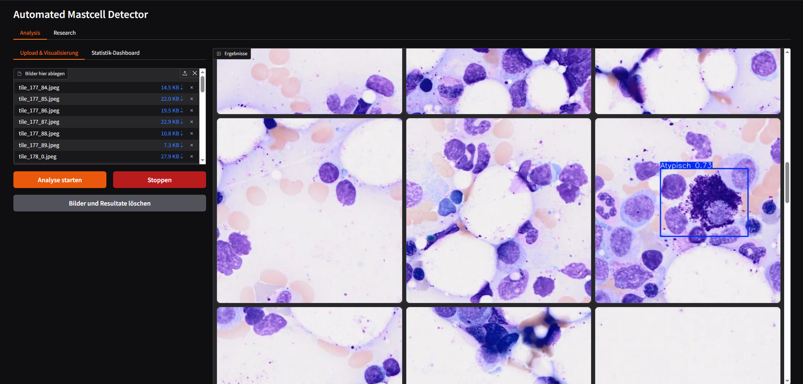
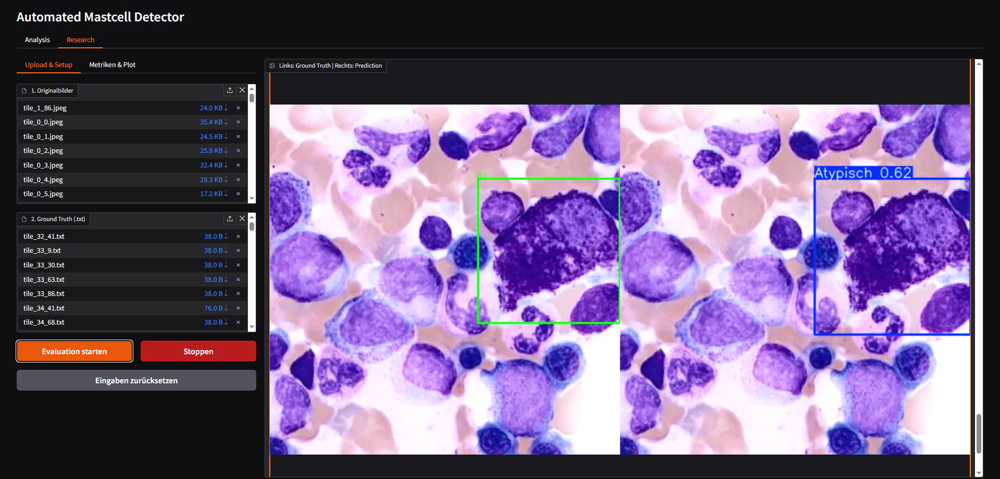
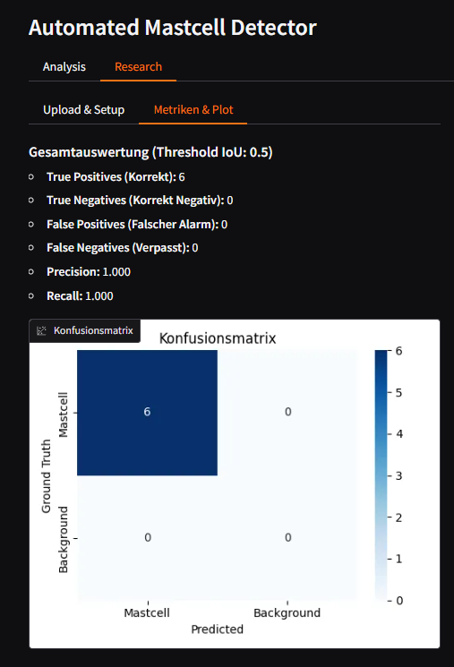
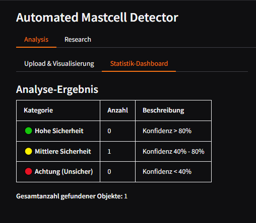
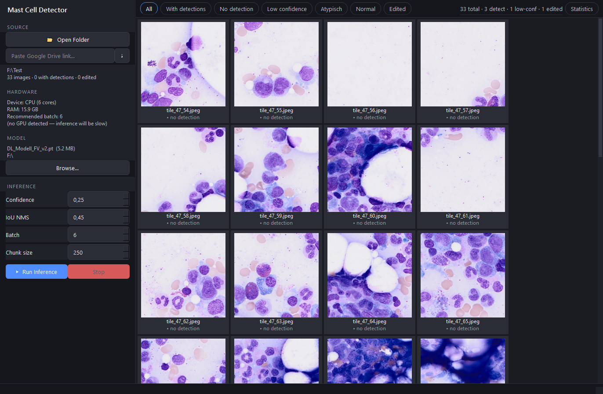
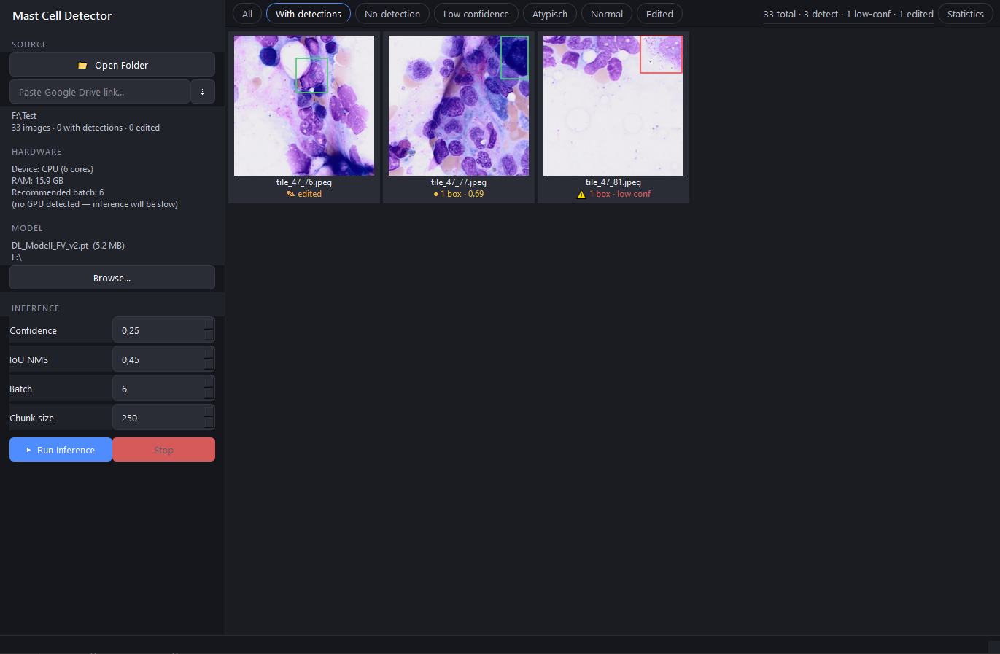
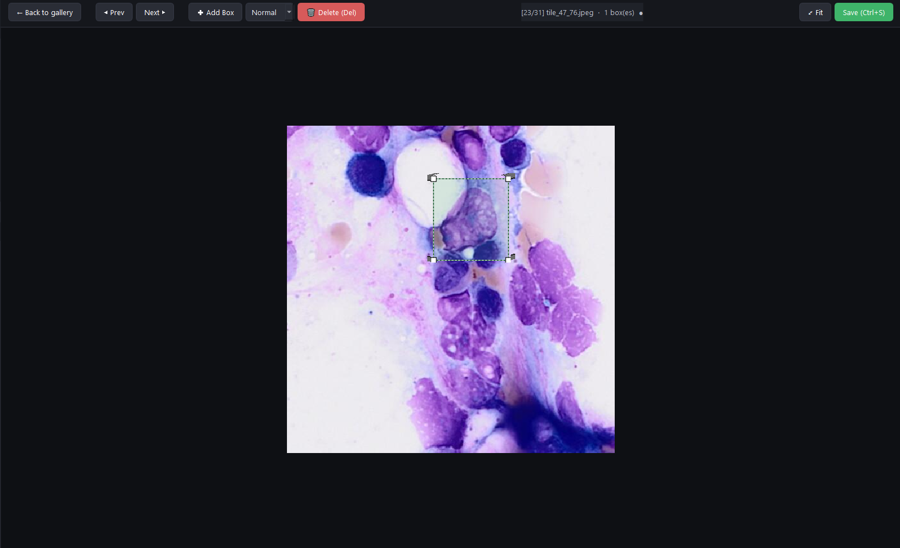
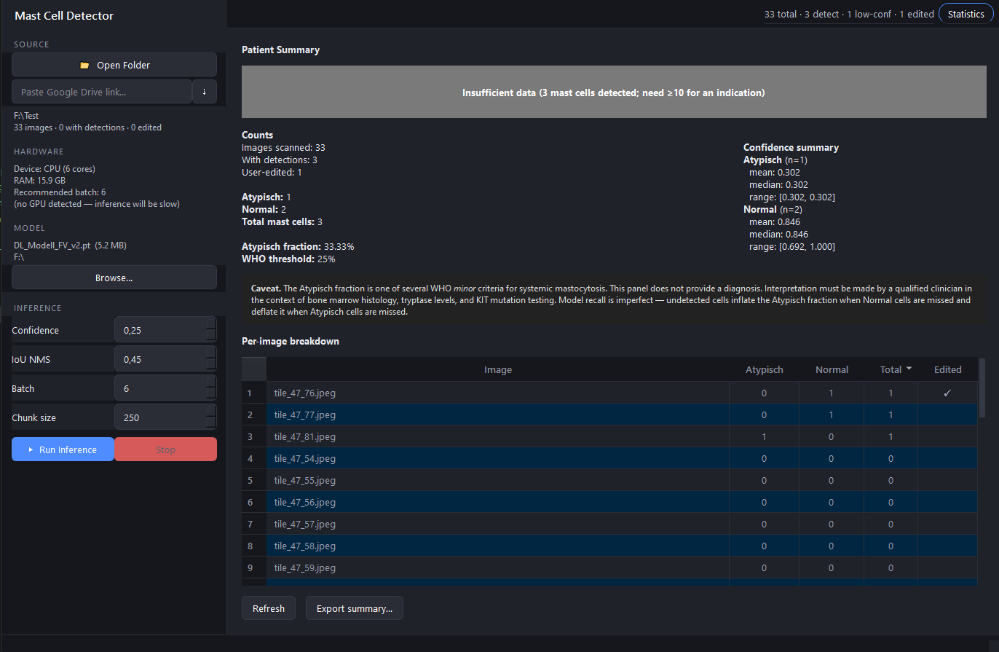
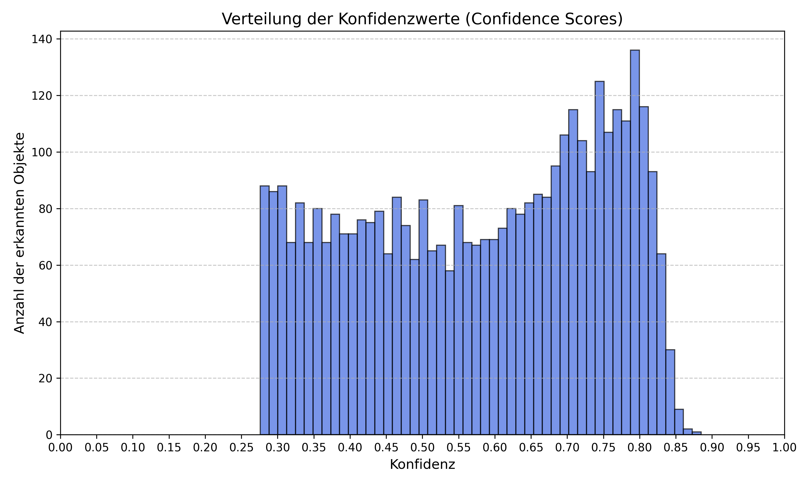

# Abstract {.unnumbered .unlisted}

### English Version

<!-- TODO: Write after Results and Discussion are complete. ~200 words.
     Hit: clinical problem, gap, approach (YOLO11n, LOPO-CV, 53 patients),
     key result (R_Normal=0.882 P4-B; P5-A pending), desktop app delivered to USZ. -->



### German Version

<!-- TODO: German translation of English abstract. -->

# Acknowledgement {.unnumbered .unlisted}

I would like to express my sincere gratitude to Dr. Stefan Glüge for setting up the project for this thesis and for his valuable support and guidance throughout the writing and compilation process of this thesis. My appreciation also goes to Robin Kosche for showing me around the USZ and introducing me to the subject.

::: {.content-hidden when-format="html"}

# Table of Contents {.unnumbered .unlisted}



:::

# List of Abbreviations {.unnumbered}

- **AI**: Artificial Intelligence
- **AP**: Average Precision
- **CNN**: Convolutional Neural Network
- **COCO**: Common Objects in Context
- **CV**: Cross Validation
- **CVAT**: Computer Vision Annotation Tool
- **DoE**: Design of Experiment
- **FN**: False Negative
- **FP**: False Positive
- **IoU**: Intersection over Union
- **LOPO**: Leave-One-Patient-Out
- **MC**: Mast Cells
- **mAP**: Mean Average Precision
- **NMS**: Non-Maximum Suppression
- **RF-DETR**: Roboflow Detection Transformer
- **SM**: Systemic Mastocytosis
- **TN**: True Negative
- **TP**: True Positive
- **USZ**: University Hospital Zurich (Universitätsspital Zürich)
- **WHO**: World Health Organization
- **YOLO**: You Only Look Once

# Introduction

<!-- NOTE: Introduction is carried over from BA_FV.qmd unchanged.
     Paste the full Introduction section here before final compilation. -->



# Methodology

## Biology of Mast Cells and Systemic Mastocytosis

<!-- NOTE: Biology section carried over from BA_FV.qmd unchanged.
     Paste here before final compilation. -->



## Technical

### General Data Information

The dataset for this study consists of digitized bone marrow aspirate smear images provided by the University Hospital Zurich (USZ). All samples were collected from patients with confirmed or suspected systemic mastocytosis. Image tiles were extracted from whole-slide scans at a fixed resolution of 512x512 pixels, each displaying a sub-section of the whole smear. Two morphological classes were labeled for this study: Atypisch (atypical mast cells) and Normal (normal mast cells), corresponding directly to the cell types relevant to the WHO minor diagnostic criterion for SM.

The corpus grew across four acquisition batches spanning 53 patients. The initial dataset covered a single patient (P1) and served as the pilot for the annotation and training pipeline. A second batch extended the corpus to 15 patients (P1-P15), contributing 1,564 annotated images with 1,288 Atypisch and 391 Normal instances, reflecting a raw class ratio of approximately 3.3:1. A third batch added patients P16 through P53, bringing the full corpus to 53 patients. Because the training data derives almost entirely from confirmed SM patients, Atypisch is the dominant class throughout. At the P1-P8 scale the raw ratio was 14.4:1; by P1-P15 this had dropped to 3.3:1 due to the inclusion of patients P6, P8, and P9, which are rich in Normal annotations.

### Data Acquisition and Annotation

The annotation pipeline was carried out by Robin Kosche at USZ using CVAT (Computer Vision Annotation Tool). Rather than annotating all 53 patients manually from scratch, an iterative model-assisted annotation strategy was used to make the labeling process tractable at the scale of tens of thousands of image tiles.

The first patient (P1) was annotated entirely by hand. Bounding boxes were drawn around each visible mast cell. This initial patient did only had Atypisch cells. This dataset was used to train the initial domain-specific detection model, DL_Modell_FV.pt, a YOLO11n checkpoint trained on P1 data.

For patients P2 through P15, CVAT's model inference integration was used with DL_Modell_FV.pt as the backend. The model generated candidate bounding boxes for each image tile, which the annotator then reviewed, accepted, corrected, or rejected. Starting from this batch, also normal cells were annotated. Tiles where the model produced detections on regions that contained no mast cell were recorded separately in per-patient Excel files. These confirmed false positives were later incorporated into training as a curated set of hard-negative examples.

For patients P16 through P53, the same workflow was repeated using a second-generation model (DL_Modell_FV_v2.pt), trained on the P1-P15 corpus, as the inference backend. It is worth noting that a subset of patients in this batch contained no annotatable mast cells at all: the model produced candidate detections, but all were rejected by the annotator as false positives. These patients contributed no positive labels to the corpus but supplied a large number of confirmed hard negatives. The annotations from the full P1-P53 corpus were then used to train a third-generation model, DL_Modell_FV_v3.pt, completing the bootstrapped annotation cycle at the current project scope.

This iterative approach, where each annotation round produces a labeled dataset used to train a better model for the next round, allowed the corpus to grow from one patient to 53 without requiring fully manual annotation of all 53 cases. The confirmed false positives collected at each round provided a particularly valuable training signal: these are the specific tiles that the model of that generation found difficult to reject, making them targeted hard negatives for the next training cycle.

This bootstrapped annotation strategy is not documented for mast cell detection in the existing literature. The systematic review by Ghete et al. @https://doi.org/10.1002/hem3.70048, covering AI-based bone marrow cell classification from 2019 to 2024, found that the majority of published studies applied their models to pre-existing datasets rather than developing annotation pipelines alongside the model. In this project, annotation and model development were tightly coupled by design: the clinical partner's annotation capacity was directly extended by each generation of model, and the confirmed false positives produced during annotation became training signal for the next generation. This coupling is what made a 53-patient corpus feasible within the scope of a single thesis.

The final corpus assembled across all three annotation rounds is summarized in @tbl-corpus.

| Category | Count |
|---|---|
| Total annotated images | 1,869 |
| Atypisch cell labels | 1,473 |
| Normal cell labels | 511 |
| Confirmed FP/Background images | 4,940 |

: Full corpus summary across P1-P53. {#tbl-corpus}

### Data Preprocessing

Two distinct preprocessing approaches were applied across the experimental timeline, with a significant revision midway through the project.

**Pre-applied augmentation (Phase 1 and early Phase 2).** For the initial experiments, a preprocessing pipeline was implemented using the albumentations library. Each annotated image was transformed once before training with random flips, brightness and contrast adjustments, and affine rotations of up to 15 degrees. The augmented copies were saved to disk and used as fixed training input. This approach proved ineffective: because transforms were applied once and stored, every training epoch saw the same augmented copies. The augmented images extended the dataset by a fixed factor but provided no additional regularization benefit after the first epoch, which is the only epoch where the transforms are novel to the model. This limitation was identified during Phase 2 and motivated the switch to on-the-fly augmentation.

**On-the-fly augmentation (Phase 3 onward).** Starting from Phase 3, augmentation was moved into the YOLO training loop by enabling augment=True in the model.train() call. This applies a fresh random transform to each image at every epoch, meaning oversampled copies in the training file list present different pixel content to the model across epochs. Two augmentation parameters required explicit configuration for this domain. The mosaic augmentation was disabled (mosaic=0.0): YOLO's mosaic mode composites four images into a single training sample, which is appropriate for multi-object scene datasets like COCO but is counterproductive for 512x512 bone marrow tiles, where the spatial relationship between a candidate cell and its immediate local context is part of the morphological signal the model needs to learn. Vertical flip probability was set to 0.5 (the YOLO default is 0), consistent with the biological reality that bone marrow mast cells have no canonical vertical orientation and that the model should not learn a vertical bias from the training data.

The rotation augmentation parameter (degrees) was treated as a tunable hyperparameter during Phase 3. A systematic tinkering matrix identified degrees=5 as optimal at the Phase 3 corpus scale, providing approximately 4-5 percentage points of improvement in Normal-class recall over degrees=0. The effect is biologically justified: mast cells present in any orientation in aspirate smears, and moderate rotation augmentation regularizes the model without distorting morphological cues that distinguish Atypisch from Normal.

### Model Selection and Architecture

YOLO11 (Ultralytics) was selected as the object detection framework. The architecture performs detection and classification in a single forward pass, making it computationally efficient for integration into clinical workflows where inference throughput matters. The Ultralytics Python API provides a consistent interface for training, fine-tuning, evaluation, and inference, and supports checkpoint initialization from custom pretrained weights, which was central to the transfer learning strategy described below. Comparable studies applying YOLO-family models to cell detection in hematological microscopy report mAP50 values in the range of 77-94% on well-represented cell types @diagnostics15010022 @DIAZ20256123, placing the architecture in the performance range expected for this domain.

Among the available YOLO11 model sizes, the nano variant (yolo11n, 2.6M parameters) was selected. The selection was validated experimentally: a test using the large variant (yolo11l, 43M parameters) on the P1-P8 corpus under identical training conditions produced R_Normal=0.695 compared to R_Normal=0.840 for yolo11n. The larger model's classification head, which is randomly re-initialized when training with a different number of output classes than the pretrained checkpoint, has proportionally more free parameters to adapt from scratch. With only 170-220 training images per LOPO (Leave-One-Patient-Out) fold, these parameters tend to overfit to the majority class rather than learn generalizable features for the rare Normal class. The corpus size at this stage was insufficient for a 43M-parameter model; yolo11n was confirmed as the appropriate architecture for the available data.

Throughout the project, all training runs started from the generic COCO-pretrained yolo11n.pt checkpoint. The single exception was a set of experiments during Phase 2 in which DL_Modell_FV.pt, a YOLO11n model previously trained on the P1 single-patient dataset (nc=1, one class), was used as the starting point for continued training on the two-class P2 dataset. The reasoning was that domain-specific pretraining might give the model a better starting point for bone marrow aspirate images compared to COCO features. In practice, this approach introduced a structural complication: because DL_Modell_FV.pt was trained with a single output class and the P2 training required two classes (Atypisch and Normal), the Detect head's classification branch (cv3, the final 1x1 convolution layer) had to be discarded and randomly re-initialized. The bounding-box regression branch (cv2) transferred cleanly, but the randomly initialized cv3 layer produced noisy classification gradients in early training epochs. At the default learning rate of lr0=0.01, these gradients were large enough to partially overwrite the pretrained neck features, causing systematic underperformance rather than the expected improvement. The full account of this failure and its resolution is described in the training strategy section. After Phase 2, the project returned to yolo11n.pt as the standard base for all subsequent training.

### Model Training and Finetuning Strategy

The training strategy developed across five phases, each responding to specific failures and insights from the previous phase. The following account describes the major decision points rather than every individual run; a complete run table is provided in the Results section. The phase structure corresponds to successive expansions of the training corpus and methodology: Phase 1 covered a single pilot patient, Phase 2 moved to a two-class annotated dataset and explored data composition, Phase 3 introduced multi-patient LOPO cross-validation and on-the-fly augmentation on an 8-patient corpus, Phase 4 expanded to 15 patients, and Phase 5 targets the full 53-patient corpus. Individual experiment runs within each phase are identified by a label combining the phase number and a letter (e.g., P2-C, P3-A), which matches the experiment log maintained throughout the project.

**Phase 1: Single-patient proof of concept and hyperparameter search.**

Phase 1 covered a sequence of experiments on the P1 dataset (428 images, single patient, Atypisch class only) using 5-fold stratified cross-validation and the pre-applied albumentations augmentation pipeline described above. The dataset consisted of annotated positive tiles alongside hand-curated negative tiles (confirmed empty regions), all at 512x512 pixels.

The initial runs used yolo11n.pt (COCO pretrained). To test whether a larger model would learn better features for this domain, yolo11l (43M parameters) was then substituted and run in three separate configurations, including extended epoch budgets (200 epochs) and added augmentation. In each case, the large model did not outperform yolo11n on this single-patient dataset, and the project returned to yolo11n for all further Phase 1 work. This finding prefigured the same result later confirmed empirically at larger scale in Phase 3 (P3-E), where yolo11l again underperformed yolo11n on a multi-patient corpus.

With yolo11n established as the appropriate architecture, hyperparameter tuning was run using YOLO's built-in model.tune() function across three increasingly intensive rounds: 30 iterations x 50 epochs, 300 iterations x 50 epochs, and finally 300 iterations x 100 epochs. The output of the final tuning round was a best_hyperparameters.yaml file with optimized values including lr0=0.0062, momentum=0.791, mosaic=0.916, and degrees=0.0. A training run applying these tuned hyperparameters completed Phase 1. The per-fold results are reported in the Results section.

The best_hyperparameters.yaml produced by the Phase 1 tuner is significant beyond Phase 1: it was later applied to fine-tuning on P2 data (P2-E) and caused catastrophic forgetting, collapsing performance across all five folds. The failure was later attributed to a recipe mismatch: the tuner had optimised on a from-scratch yolo11n training run, and its output (particularly the high mosaic value and degrees=0.0) was calibrated for scratch training from COCO, not for fine-tuning in this clinical domain. The Phase 1 yaml was permanently retired from the fine-tuning pipeline as a result.

Following the 5-fold training, an inference run was conducted on the full first-patient slide image set, approximately 20,000 tiles, excluding all training images by filename. The resulting confidence distribution provided an early look at the model's behavior at deployment scale and informed the direction of subsequent annotation and training work.

**Phase 2: The domain-specific checkpoint experiment and the learning rate problem.**

Phase 2 began with two runs using the standard yolo11n.pt base on the annotated P2 dataset (P2-A, P2-B), but both were corrupted by a concurrent SLURM job collision described below. The third run (P2-C) introduced DL_Modell_FV.pt as the starting point, testing whether the P1-trained domain-specific model would give the detector a better foundation than COCO-pretrained weights. The result was a characteristic failure pattern: high precision combined with very low recall, the signature of a model that makes few predictions and misses most cells. The cause was the interaction between the randomly re-initialized cv3 head and the default learning rate of lr0=0.01: the noisy gradients from the freshly initialized classification branch were large enough to partially overwrite the pretrained neck features during early epochs, leaving the model worse than yolo11n.pt would have been from scratch.

Reducing the learning rate to lr0=0.001 recovered the performance lost to this overwriting effect. Freezing the first ten backbone layers (freeze=10) was introduced alongside the learning rate change to prevent the small dataset from further disrupting features that COCO pretraining had established. This combination (lr0=0.001, freeze=10) defined the reference configuration for the remainder of Phase 2. However, the conclusion drawn from the full Phase 2 experiment set was that using DL_Modell_FV.pt as a starting point added complexity without a measurable benefit over yolo11n.pt, and all subsequent phases returned to the standard COCO-pretrained base.

Before expanding to the full P1-P15 corpus that would produce the second model version, a 3x4 factorial design-of-experiment (DoE) grid was run to identify the best data composition strategy at Phase 2 scale. The goal was practical: the hyperparameter and data configuration choices made here would carry forward into the P1-P15 training, and a better second model version meant fewer manual corrections for the annotation partner at USZ when working through patients P16-P53. The grid varied confirmed FP negative oversampling (1x, 2x, 3x) and random background tile ratio (0, 1, 2, 3) across twelve configurations. The mAP50 spread across all twelve DoE configurations was smaller than the cross-fold standard deviation within any single run. Data composition manipulations at single-patient scale could not produce statistically interpretable performance differences; the limiting factor was data scarcity rather than class balance. Background tiles uniformly hurt performance at every FP oversampling level, and this finding was consistent enough to permanently set the random background ratio to zero in all subsequent runs. The DoE finding reframed the problem: improving recall required more patients and better augmentation, not a different ratio of existing data categories. This result has broader relevance for rare-event medical imaging tasks where the class imbalance is not accidental but structural: when a dataset is collected from disease-positive patients, the minority class is underrepresented because the disease itself is rare in that morphological form, not because of sampling bias. In that regime, reweighting or resampling the existing data cannot substitute for collecting more biologically diverse examples. The systematic nature of the DoE grid makes this conclusion more than a project observation; it is a controlled negative result that points practitioners toward corpus expansion as the primary lever for rare-class recall improvement.

Phase 2 also exposed an infrastructure failure specific to the HPC environment. Submitting two SLURM jobs concurrently caused both jobs to share the same temporary workspace directories, because directory paths were derived from fold indices without job-level namespacing. Concurrent writes to shared directories corrupted three of five folds in each job, detectable by fold results that were bit-for-bit identical between the two affected runs. The fix applied $SLURM_JOB_ID namespacing to all temporary directories and derived the output project directory name from the job name set at sbatch submission time, making concurrent jobs structurally independent.

**Phase 3: Multi-patient LOPO and on-the-fly augmentation.**

Phase 3 restructured the training and evaluation design around three simultaneous changes: expansion to 8 patients, adoption of Leave-One-Patient-Out cross-validation, and the switch to on-the-fly augmentation.

The LOPO design was motivated by a systematic bias in the Phase 1 and Phase 2 stratified k-fold protocol. When images from the same patient appear in both training and validation splits, the model can exploit patient-specific staining characteristics and morphological style to improve validation metrics without learning features that generalize to new patients. LOPO eliminates this by holding out all images from a single patient per fold, making each fold an evaluation of genuine cross-patient generalization.

The combined effect of these three changes was substantial. The Phase 3 baseline run (P3-A: 8 patients, yolo11n.pt, augment=True, mosaic=0.0, cls=1.0) achieved the strongest results seen to that point in the project, with cross-fold standard deviation markedly lower than the Phase 2 DoE despite the harder evaluation protocol: the more diverse training corpus more than compensated for the stricter holdout design. Full results are reported in the Results section.

With the same goal of finding the best possible training recipe before the P1-P15 training that would produce the second model version, a tinkering matrix of 14 parameter combinations explored rotation degrees (0, 5, 10), distribution focal loss weight dfl (1.5, 2.0), backbone freeze depth (0, 10), and label smoothing (0.0, 0.1). The production recipe confirmed here would be directly applied to the P1-P15 training: a higher-quality second model version meant the annotation partner at USZ would need fewer manual corrections when processing patients P16-P53. Rotation degrees was the dominant factor: degrees=5 consistently improved R_Normal over degrees=0 across all freeze and dfl combinations. Mast cells present in all orientations in aspirate smears, and moderate rotation augmentation directly targets this. The dfl parameter showed a consistent directional effect: dfl=2.0 regressed R_Normal relative to dfl=1.5 across all other parameter combinations, suggesting that increasing localisation loss weight tilts model capacity away from the classification discrimination needed for the rare Normal class. Freeze depth confirmed the Phase 2 finding: freeze=10 outperformed freeze=0 in every recall-relevant comparison. Label smoothing proved inert in this Ultralytics version, likely because the implementation does not propagate the parameter through the classification loss path.

The production recipe confirmed by the tinkering matrix was: degrees=5, dfl=1.5, freeze=10, lr0=0.001, cls=1.0, augment=True, mosaic=0.0, flipud=0.5.

An automated hyperparameter search using YOLO's built-in model.tune() was run on the production recipe (30 iterations, 50 epochs, patient P4 as holdout, mAP50-95 as fitness). The tuner converged on degrees=0.0 and dfl=2.47, both directions that the tinkering matrix had identified as harmful to R_Normal. The explanation is structural: a single-fold tuner optimizing mAP50-95 on a P4 holdout (an Atypisch-dominant patient) maximizes Atypisch-class performance at the expense of Normal-class generalization. Single-fold automated tuning is blind to cross-patient per-class recall balance. The production recipe from the tinkering matrix was retained.

A model-size comparison test (P3-E) substituted yolo11l (43M parameters) for yolo11n (2.6M parameters) under identical conditions on the P1-P8 corpus. R_Normal dropped to the lowest value measured across the entire project. The larger model's randomly re-initialized classification head has more free parameters, and at approximately 170-220 training images per fold the model memorized Atypisch patterns rather than learning generalizable Normal features. This result confirmed yolo11n as the appropriate model size for the available corpus.

The production recipe confirmed by Phase 3 was carried forward and applied to train on the full P1-P15 corpus, producing the second model version (DL_Modell_FV_v2.pt) that the annotation partner at USZ used for patients P16-P53.

**Phase 4: Corpus expansion to 15 patients.**

Phase 4 expanded the training corpus to 15 patients (1,564 images, 1,288 Atypisch, 391 Normal, 2.464 Background images incl. FP; raw ratio 3.3:1, effective ratio 1.5:1 after automatic per-patient oversampling). The most significant addition was patient P9, which contributed 195 Normal annotations, more than doubling the total Normal count relative to the P1-P8 corpus. A 15-fold LOPO protocol was applied.

The first Phase 4 run (P4-A) was configured with degrees=0 due to an omitted configuration variable; the second run (P4-B) applied the full production recipe including degrees=5. The delta between the two runs was within the cross-fold standard deviation on all metrics, indicating that the benefit of degrees=5 observed at P1-P8 scale either diminishes with a more diverse 15-patient corpus or is within measurement noise at this scale. A freeze ablation run (P4-C, freeze=0) produced results essentially equivalent to P4-B across all metrics, confirming that backbone freezing remains appropriate and the P3-B recipe transfers to the larger corpus without re-tuning. Full per-fold results for P4-A, P4-B, and P4-C are reported in the Results section.

**Phase 5: Full corpus (P1-P53). [Results pending]**

The Phase 5 training run (P5-A) was submitted to the ZHAW HPC cluster during the final stages of this thesis. The run uses the confirmed production recipe (degrees=5, dfl=1.5, freeze=10, lr0=0.001, cls=1.0), fully automatic per-patient oversampling targeting a 2:1 Atypisch:Normal ratio, and a LOPO design across all annotated patients after filtering out patients with no mast cell labels. Results were not available at the time of writing and will be incorporated in the final version of this thesis.

### Model Testing

Performance estimates in this thesis are reported under two different evaluation protocols depending on the phase. Phase 1 and Phase 2 used stratified k-fold cross-validation (5 folds), where images were split randomly across folds with class stratification. From Phase 3 onward, the evaluation protocol was changed to LOPO, where all images from one patient are withheld from training entirely and used exclusively for evaluation. The switch was motivated by a systematic bias identified in the Phase 1 and Phase 2 results: stratified k-fold splits on small medical imaging datasets allow patient-level texture and staining style to leak from training into validation, artificially improving validation metrics without reflecting true cross-patient generalization. LOPO results and stratified k-fold results are therefore not directly comparable and are reported separately in the Results section.

Choosing LOPO over stratified k-fold directly addresses a gap identified in the broader literature. Ghete et al. @https://doi.org/10.1002/hem3.70048 found that performance metrics across published bone marrow cell classification studies are not directly comparable in part because most studies evaluate on subsets of their own data, with few reporting results on patient-held-out splits and fewer still validating externally. LOPO is the strongest within-dataset approximation of external validation available without access to a second institution's data: each fold evaluates the model on a patient it has never seen in any form, under the same conditions a deployed system would face in routine clinical use. The cross-fold standard deviation reported in this thesis therefore reflects genuine inter-patient biological variability rather than statistical noise from random sampling, making the performance estimates more conservative and more informative than single-split or random k-fold results typically reported in the field.

Each fold produced a training split, a validation split used only for early stopping during training, and a test split consisting of the held-out patient's images. The metrics reported throughout this thesis refer to the test split. Across folds, the mean and standard deviation of each metric were computed. The cross-fold standard deviation reflects genuine inter-patient biological variability; patients with very small annotated sets (for example, P13 with 7 images) produce test metrics with extreme sensitivity, where a single missed cell changes recall by more than 14 percentage points.

One measurement limitation was identified in the per-class recall extraction. The implementation indexed Ultralytics' per-class result arrays by position rather than by class label index. When one class was absent from both ground truth and predictions in a given fold, Ultralytics returned a shorter result array and positional indexing misassigned recall values. This affected primarily the P13 holdout fold in every run, where the reported R_Normal was NaN while the true Normal recall appeared in the R_Atypisch position. Folds affected by this issue are excluded from per-class mean calculations throughout this thesis, and the directions of the per-class trends are verified against folds where the per-class counts are large enough to confirm correct assignment.

### Evaluation Metrics

Model performance was assessed using standard metrics from object detection. Each detection outcome is first classified into one of four categories based on whether the model's predicted bounding box overlaps sufficiently with a ground-truth annotation (at a minimum Intersection over Union of 0.50):

- **True Positive (TP):** the model correctly detected a mast cell and the predicted box sufficiently overlapped the ground-truth annotation.
- **True Negative (TN):** the model correctly produced no detection in a tile containing no annotated mast cell.
- **False Positive (FP):** the model predicted a mast cell where the ground truth showed none (a false alarm).
- **False Negative (FN):** the model failed to detect a mast cell that was present in the ground truth (a missed cell).

From these, the following performance indicators were computed [PA2_FV]:

**Precision** measures the proportion of predicted detections that were correct:

$$\text{Precision} = \frac{TP}{TP + FP}$$

**Recall** measures the proportion of ground-truth mast cells that the model successfully detected:

$$\text{Recall} = \frac{TP}{TP + FN}$$

**mAP50** (Mean Average Precision at IoU 0.50) is the mean of the per-class Average Precision computed at a bounding-box overlap threshold of 50%. AP is the area under the precision-recall curve; mAP50 averages this across all classes:

$$\text{mAP50} = \frac{1}{N} \sum_{i=1}^{N} AP_{i@50}$$

**mAP50-95** extends mAP50 by computing AP (Average Precision) at ten evenly spaced IoU thresholds from 0.50 to 0.95 (`torch.linspace(0.5, 0.95, 10)`) and averaging the result across thresholds and classes @Jocher_Ultralytics_YOLO_2023. It penalises imprecise bounding box localisation more heavily than mAP50.

Recall is the primary metric for this project. A missed mast cell (false negative) causes the Atypisch fraction to be underestimated, potentially placing a patient below the WHO 25% diagnostic threshold and delaying diagnosis of SM. A false positive is less consequential for two reasons: the clinical workflow includes a manual review step where false alarms can be dismissed, and the diagnostic impact of a false positive depends on how far the true ratio is from the 25% threshold. In a patient with a strongly atypical cell population, a moderate false positive rate does not change the clinical conclusion because the Atypisch fraction remains clearly above the threshold. False positives become clinically relevant primarily in borderline cases where the ratio is close to 25%, and it is precisely in those cases that the manual review step is most likely to be exercised.

Two per-class recall metrics are tracked separately throughout the experiments: R_Atypisch (recall for the Atypisch class) and R_Normal (recall for the Normal class). Both are clinically necessary because the WHO criterion depends on the ratio of Atypisch to total detected mast cells. Undercounting Normal cells inflates this ratio, potentially triggering a false-positive SM classification in borderline patients. Tracking both classes independently, rather than reporting a single aggregate recall, is a direct consequence of aligning the evaluation to the diagnostic question rather than to standard object detection benchmarking practice. Published studies in adjacent domains, such as general white blood cell subtype classification, typically optimize for aggregate mAP or F1 across all classes @DIAZ20256123; this thesis treats R_Normal as a primary metric in its own right because the WHO threshold makes the Normal count as diagnostically load-bearing as the Atypisch count. R_Normal received particular experimental attention because Normal is the minority class in the training corpus, consistently exhibiting lower recall and higher cross-fold variability than R_Atypisch.

mAP50 is used as the standard benchmark for run-to-run comparison across the experimental timeline, providing a single-number summary that captures both detection and classification quality. mAP50-95 is reported where available but assigned less interpretive weight; localisation precision at high IoU thresholds is clinically less relevant than detection recall for this task. Precision is monitored throughout but treated as a secondary metric.

### UI Creation

**Gradio Prototype**

An initial web-based interface was developed using Gradio to support early-stage result visualization and model evaluation during development. The prototype provided two functional tabs. The Analysis tab ran batch inference on image directories and displayed tiles with YOLO detection overlays (@fig-gradio-analysis), producing labeled output images. The Research tab supported ground-truth versus prediction comparison (@fig-gradio-research-det, @fig-gradio-research-metrics), applying a lower confidence threshold to maximize recall sensitivity during evaluation. A statistics dashboard (@fig-gradio-stats) aggregated per-class detection counts and displayed the Atypisch fraction relative to the WHO 25% threshold. The Gradio prototype served its purpose as a rapid development tool and was later superseded by the desktop application.

{#fig-gradio-analysis}

{#fig-gradio-research-det}

:::{layout-ncol=2}

{#fig-gradio-research-metrics}

{#fig-gradio-stats}

:::

**Desktop Application**

As the requirements for clinical deployment became clearer, it became apparent that a browser-based interface was not adequate for the actual usage context at USZ. A full patient slide scan produces approximately 20,000 image tiles, and a Gradio-based interface was not designed for streaming inference at that scale. Cinderella, the cell classification software already in use at USZ, was considered as an integration target, but embedding the pipeline into an existing hospital codebase within the thesis timeline was not feasible: the time required to understand a production clinical codebase combined with the security validation and change management processes required for hospital software integration extended well beyond the project scope.

A native desktop application (MastCellDetector) was developed as the primary clinical deliverable. The application was built with PyQt and packaged using PyInstaller into a self-contained executable that requires no Python environment on the target machine. While the primary deployment target is Windows workstations at USZ, PyInstaller equally supports Linux builds, making the same application distributable on Linux servers or HPC systems.

The intended workflow for a USZ analyst proceeds as follows. The analyst opens a local folder containing a patient's image tiles. The sidebar provides controls for confidence threshold, IoU non-maximum suppression threshold, and hardware selection (GPU with automatic VRAM-based batch size recommendation, or CPU fallback). Running inference streams YOLO-format label files to disk alongside each image in real time, so results are preserved if the run is interrupted. The gallery view (@fig-desktop-gallery) displays all images with filter tabs for All images, With detections (@fig-desktop-detections), No detection, Low confidence, Atypisch only, and Normal only. This allows a haematologist to navigate directly to the cases most likely to need manual review rather than scrolling through tens of thousands of tiles.

{#fig-desktop-gallery}

{#fig-desktop-detections}

An annotation editor is embedded in the gallery. Clicking any thumbnail opens the image with interactive bounding boxes (@fig-desktop-editor): boxes can be repositioned by dragging, resized by dragging corner handles, and deleted with the Delete key. New boxes are drawn by pressing A and clicking and dragging a region, with class selected from a dropdown. Changes are saved to the corresponding label file with Ctrl+S or automatically on navigation to the next image. When a box is deleted as a false positive, an empty label file is written, marking the tile as a confirmed negative for any future retraining cycle. Edited files are protected from being overwritten by subsequent inference runs.

{#fig-desktop-editor}

The Statistics tab (@fig-desktop-stats) aggregates per-image detection counts into a patient-level summary that displays the total detected mast cells, the Atypisch fraction as a percentage, and a visual marker relative to the WHO 25% diagnostic threshold. This summary can be exported for clinical documentation or further analysis.

{#fig-desktop-stats}

### Implementation in USZ Infrastructure

The primary deliverable of this project is the MastCellDetector desktop application, distributed as a self-contained Windows directory. The application operates entirely offline after installation, which satisfies a practical requirement for deployment in hospital network environments where internet access from clinical workstations is restricted or prohibited.

The model shipped with the final version of the desktop application will be DL_Modell_FV_v3.pt, trained on the complete P1-P53 corpus using the production recipe established across Phases 3 and 4. This model was not yet available at the time of writing.

<!-- TODO: Once P5-A (full corpus training on P1-P53) is complete, report the final model weights and LOPO evaluation results here. Replace this placeholder with: model name, corpus size, LOPO recall/R_Atypisch/R_Normal. -->

The annotation editing and label export functionality in the application also addresses a secondary deliverable: the confirmed false positives and corrected labels produced during clinical use feed directly back into the training pipeline as the next generation of hard-negative examples, continuing the iterative annotation strategy established from Phase 1 onward.

The Linux build capability opens a second deployment path beyond the clinical workstation. A Linux build of MastCellDetector can be deployed on a computational server or HPC node at USZ, allowing the tool to be integrated directly into the institution's scan-to-inference-to-evaluation pipeline: whole-slide images are scanned, tiles are passed through the model at server-side GPU throughput, and the resulting label files and statistics export are produced without requiring a Windows workstation in the loop. This makes the same application suitable for both interactive clinical review and automated batch processing, depending on the deployment context. The source code of the application is publicly available @Vollmer2026MastCellDetector.



# Results

## Model Results and Statistical Evaluation

<!-- TODO: Write after confirming P5-A result is not yet available.
     Include: full run progression table (P1-baseline -> P3-B -> P4-A -> P4-B),
     P4-B 15-fold LOPO per-fold table with R_Atypisch and R_Normal per patient,
     P5-A placeholder row.
     Figure placeholder: [FIGURE: mAP50 and Recall progression across phases] -->

## Quantitative and Qualitative Evaluation

<!-- TODO: Per-class performance analysis.
     Key points: R_Atypisch vs R_Normal gap narrowed from 11 pp (P3-A) to 2 pp (P4-B).
     Weak folds: P1 holdout (2 Normal in test, R_Normal ~0.286 structural), P13 bug.
     Small-sample sensitivity caveat.
     Figure placeholder: [FIGURE: Per-fold R_Atypisch and R_Normal bar chart P4-B] -->

## Evaluation Visualization

<!-- TODO: Training curves, confusion matrix.
     Figure placeholders:
     [FIGURE: Confusion matrix P4-B (aggregated across folds)]
     [FIGURE: Sample detections with bounding boxes on Atypisch and Normal cells] -->

## Real World Usage

### Tests With Unseen Data

After Phase 1 training, an inference run was conducted on the complete first-patient slide set, approximately 20,000 tiles, with all training images excluded by filename. This was an exploratory step: the model had only seen a fraction of the slide during training, and running it across the full scan gave an early read on its behavior at deployment scale. The resulting confidence distribution, shown in @fig-conf_p1, illustrates how the Phase 1 model separated high-confidence detections from low-confidence responses across the full tile set. The distribution was reviewed together with Robin Kosche and Dr. Stefan Glüge to understand where the model was uncertain and to guide the direction of subsequent annotation and training work.

{#fig-conf_p1}

<!-- TODO: Describe inference run on new patient slides using the desktop app. -->



# Discussion

## Interpretation of Results

<!-- TODO: Answer all three research questions from the Introduction:
     RQ1: Recall (and R_Normal specifically) are the most critical metrics;
          mAP50 as secondary; precision monitored but not primary.
     RQ2: Pipeline handles rare-event detection; confidence threshold 0.58
          calibrated to balance recall vs FP rate; R_Atypisch=0.900 and
          R_Normal=0.882 demonstrate both classes are reliably detected.
     RQ3: P4-B results directly support the WHO 25% criterion:
          R_Normal=0.882 and R_Atypisch=0.900 mean both classes contributing
          to the ratio are reliably counted.

     Novelty framing (three angles):
     1. First validated LOPO pipeline for Atypisch vs Normal MC binary
        classification aligned to the WHO 25% criterion.
     2. Model-assisted iterative annotation loop (P1 -> DL_Modell_FV.pt ->
        P2-P15 -> v2 -> P16-P53) as a data acquisition strategy that
        scales rare-cell annotation without proportional manual effort.
     3. Empirical finding that corpus expansion dominates over hyperparameter
        tuning for rare-class recall -- a transferable lesson for rare-event
        medical imaging. -->

## Clinical Relevance

<!-- TODO: Connect results to clinical workflow at USZ.
     WHO 25% threshold, the diagnostic consequence of FN vs FP,
     the desktop app as the bridge deliverable. -->

## Error Analysis

<!-- TODO: Known failure modes: P1 holdout structural weakness (old annotation regime),
     per-class indexing bug, small-patient sensitivity, all-SM-patient corpus limitation
     (generalization to non-SM patients is out-of-distribution). -->



# Conclusion

## Summary of Key Findings

<!-- TODO -->

## Limitations and Challenges

<!-- TODO -->

## Future Research Directions

<!-- TODO: P5-A result, full-corpus final model (P1-P53 equivalent of P3-D),
     cls ablation at expanded scale, Cinderella integration when institutional
     timeline permits, external validation set. -->



# Declaration on AI Assistance

The author declares that the empirical research, data analysis, experimental design, and quantitative results presented in this thesis were generated independently and strictly remain the intellectual property of the author.

Artificial intelligence (AI) assistance was utilized solely for the purpose of language refinement, stylistic editing, and optimization of academic reading flow. Specifically, the AI models (Gemini 2.5 Pro, Claude Sonnet 4.5, and Claude Sonnet 4.6) were employed to translate text, correct grammar, and restructure sentences into the required third-person past tense and formal academic style.

No core scientific content, model selection decisions, hyperparameter choices, or interpretation of results were delegated to or generated by the AI model.

# References {#sec-refs}



::: {.content-hidden when-format="html"}

[9] Gemini 2.5 Pro. (n.d.). Google Gemini. Retrieved October 1, 2025, from <https://gemini.google.com/app>

[10] DeepL Translate: The world's most accurate translator. (n.d.). <https://www.deepl.com/>

# Lists

## List of Figures {.unnumbered}



## List of Tables {.unnumbered}



:::

# Attachments
